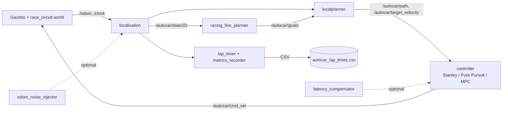

# High-Speed Autonomous Racing - SONIC ROS 2

**Project D - Final Report**

> Target: 10 pages PDF (this Markdown file is converted with `pandoc docs/REPORT.md -o report.pdf`).
> This file is written incrementally throughout the project. Each section header lists the milestone after which it should be filled in.

---

## Team

| Member | Role | Primary contributions |
|---|---|---|
| TODO name 1 | TODO (e.g. controllers) | TODO |
| TODO name 2 | TODO (e.g. trajectory) | TODO |
| TODO name 3 | TODO (e.g. validation) | TODO |
| TODO name 4 | TODO (e.g. docs/report) | TODO |

**Task distribution rule:** every node and every experiment has one explicit owner. Pair-programming sessions are tracked in commits via co-author tags.

---

## 1. Introduction (fill after step 0)

### 1.1 Problem statement
TODO - one paragraph from the brief, plus the specific success criterion: beat the 190.9 s Stanley baseline on `race_circuit.world` without leaving the track.

### 1.2 Why this is a system-integration problem
TODO - emphasize that the grading focuses on *how components work together* and on *engineering validation*, not on a single clever algorithm.

---

## 2. System architecture (fill after step 3)

### 2.1 Topic contract
A single bus of ROS 2 topics ties the system together. New modules slot in without forking the pipeline.

| Topic | Type | Purpose | Owner |
|---|---|---|---|
| `/autocar/state2D` | `autocar_msgs/State2D` | filtered vehicle state | `localisation` |
| `/autocar/goals` | `autocar_msgs/Path2D` | global waypoints | `globalplanner` or `racing_line_planner` |
| `/autocar/path` | `autocar_msgs/Path2D` | local path segment | `localplanner` |
| `/autocar/target_velocity` | `std_msgs/Float64` | target linear velocity | `localplanner` |
| `/autocar/cmd_vel` | `geometry_msgs/Twist` | `linear.x` = speed, `angular.z` = **steering angle** (Ackermann) | `tracker` / `pure_pursuit` / `mpc` |
| `/autocar/lap_time`, `lap_count`, `current_lap_time` | `Float64`/`Int32` | timing instrumentation | `lap_timer` |
| `/autocar/lateral_error` (new) | `Float64` | cross-track error for metrics | controller |

### 2.2 Block diagram
TODO - replace with the Mermaid diagram exported to PNG.



### 2.3 Module-level switching
A single launch parameter switches the controller, the line, the profile and the perturbations. See `launches/launch/race_launch.py`.

```bash
ros2 launch launches race_launch.py \
    controller:=pure_pursuit \
    line:=racing \
    profile:=aggressive \
    latency_ms:=0 \
    odom_noise_std:=0.0
```

This is what makes the system measurable: every CSV row carries the parameter set.

---

## 3. Implementation (fill incrementally)

### 3.1 From Stanley to Pure Pursuit

#### Baseline: Stanley controller (inherited)

The existing `tracker.py` implements the Stanley method (Hoffmann et al., 2007). It computes two errors at the front axle and combines them into a single steering command:

- **Cross-track error** `e`: signed lateral distance from the front axle to the nearest point on the path.
- **Heading error** `psi`: signed angle between the vehicle yaw and the path tangent at that point.

The steering angle is:

```
delta = psi + arctan( k * e / (k_soft + v) )
```

where `v` is the current longitudinal speed, `k` is the cross-track gain (default 1.0 in `navigation_params.yaml`) and `k_soft` damps the response at low speed to avoid singularities. The steering is then saturated to `+/- max_steer` (0.95 rad in our config).

#### Why Stanley plateaus at high speed

The Stanley formulation is excellent at low to moderate speed because the cross-track term reacts immediately to any lateral deviation. At racing speeds, however, three properties become liabilities:

1. **No anticipation**: the controller only reads the *current* nearest path point, so it always reacts after the geometry has changed. In a fast S-curve, the car arrives at the apex with a steering command computed for the previous straight.
2. **Oscillation on aggressive tuning**: increasing `k` to react faster causes the cross-track term to dominate; the car snaps onto the path, overshoots, and snaps back. The 1/(k_soft + v) damping helps but does not eliminate the effect.
3. **No coupling to curvature**: Stanley produces the same steering command for a given (e, psi) pair regardless of whether the upcoming path turns left, right, or stays straight.

These limitations are why the baseline lap time stalls at 190.9 s on `race_circuit.world` with cruise velocity 6.0 m/s: the controller is stable but conservative, and pushing the cruise target higher quickly makes Stanley unstable.

#### Pure Pursuit (target controller for this project)

Pure Pursuit (Coulter, 1992) takes a fundamentally different approach. Instead of measuring error against the nearest point, it picks a **lookahead point** `(x_L, y_L)` on the path at a fixed distance `Ld` ahead of the rear axle, and computes the steering angle that would carry the vehicle along the circular arc from the current pose to that point.

For a bicycle model with wheelbase `L`, the resulting steering law is:

```
delta = arctan( 2 * L * sin(alpha) / Ld )
```

where `alpha` is the angle between the vehicle heading and the line from the rear axle to the lookahead point. The arc geometry is exact for the kinematic bicycle, so the controller is correct by construction rather than by tuning.

**Dynamic lookahead.** A constant `Ld` is a poor choice in practice: too short and the controller becomes nervous, too long and the car cuts corners. The standard racing recipe is to scale `Ld` with the current speed:

```
Ld = k_v * v + Ld_min
```

where `Ld_min` (around 1.5 m) guarantees stability at standstill and `k_v` (typically 0.3 to 0.6 s) sets how aggressively the controller looks ahead. At 1 m/s the car looks ~2 m forward (precise tracking); at 8 m/s it looks ~5 m forward (smooth, fast tracking with implicit corner cutting).

#### Why this matters for the racing target

Pure Pursuit gives three properties Stanley cannot:

1. **Inherent anticipation** through the lookahead.
2. **Natural damping** at high speed because `Ld` grows with `v`.
3. **Decoupled longitudinal tuning**: the speed profile (Section 3.2) sets `v`, the lookahead adapts, and the controller stays geometric. This is the standard architecture for closed-loop racing in the literature.

The implementation lives in `pure_pursuit.py` (Section 5 details the design and code structure). It publishes on the same topic contract as `tracker.py` (`/autocar/cmd_vel`, `/autocar/lateral_error`) so the metrics CSV and the `bench.py` harness do not change.

#### Steering saturation and limits

Both controllers must respect the Ackermann steering limit of the simulated vehicle. We saturate the output to `+/- max_steer = 0.95 rad` (same value as Stanley) before publishing, and also limit the *rate* of change `|d delta / dt| <= delta_rate_max` to keep the simulated mechanism realistic. The `steering_rate_max` column of the CSV records the observed peak so that we can verify each profile stays within the configured envelope.

### 3.2 Racing line (step 5)
TODO - min-curvature optimization between left/right track boundaries. Solver: QP (`cvxpy`). Output: optimized waypoints + curvature-based speed profile `v = sqrt(mu * g / |kappa|)` clipped to `v_max`.

### 3.3 Tuning profiles (step 4)
| Profile | `lookahead_base` (m) | `k_lookahead` | `v_max` (m/s) | `a_max` (m/s2) | `mu_assumed` |
|---|---|---|---|---|---|
| Conservative | TODO | TODO | TODO | TODO | TODO |
| Balanced | TODO | TODO | TODO | TODO | TODO |
| Aggressive | TODO | TODO | TODO | TODO | TODO |

### 3.4 Latency compensation (step 6)
TODO - input: `latency_ms` parameter. Method: forward-predict state by `latency_ms` using current velocity and yaw rate, feed the predicted state to the controller.

### 3.5 Odometry noise injection - bonus (step 7)
TODO - node that republishes `/autocar/state2D` with additive Gaussian noise `(sigma_xy, sigma_yaw)` on position and orientation. Activated only when `odom_noise_std > 0`.

---

## 4. Validation methodology (fill after step 2)

### 4.1 Metrics recorded per lap
TODO - extended CSV columns: `controller`, `profile`, `latency_ms`, `odom_noise_std`, `lateral_error_rms`, `lateral_error_max`, `steering_rate_max`, `offtrack_events`.

### 4.2 Experimental harness `bench.py`

Manual comparison of controllers is unmanageable beyond a few runs: at three minutes per lap and several configurations to benchmark, the experimenter spends most of their time babysitting Gazebo windows. The project therefore ships `scripts/bench.py`, a thin Python harness that reads a matrix of experiments and drives the simulation end-to-end without human intervention.

#### Matrix format

Each row of the matrix is one launch. The harness understands YAML or JSON:

```yaml
- controller: pure_pursuit
  profile: aggressive
  latency_ms: 0
  odom_noise_std: 0.0
  n_laps: 5
```

The five fields are forwarded as launch arguments to `race_launch.py`. The `lap_timer` node then writes each completed lap to `~/.ros/autocar_lap_times.csv` with those same values in its row, so every measurement is self-describing.

#### Execution loop

For each row:

1. SIGKILL any leftover `gzserver`, `gzclient`, or `ros2 launch` from a previous run, then wait `COOLDOWN_S = 3 s`.
2. Note the current number of data rows in the metrics CSV.
3. `subprocess.Popen` a `bash -lc` invocation that sources ROS Humble, sources the local install, and launches `race_launch.py` with the parameters from the row. The child is placed in its own process group via `preexec_fn=os.setsid` so the harness can kill the whole tree later.
4. Poll the CSV row count every 2 s. When `n_laps` new rows have appeared, send `SIGTERM` to the process group, then `killall gzserver gzclient` as a belt-and-braces safety net.
5. If a configurable per-lap wall-clock deadline (`LAP_TIMEOUT_S = 600 s`) elapses without the expected rows, abort the run and mark it `timed_out` in the summary.

#### Aggregation policy

After all runs complete, `bench.py` re-reads the CSV, filters by `session_id` (each run produces a unique one written by `lap_timer`), discards the first `n_warmup` laps (default 1, the warmup from rest), and computes:

- median, std, min and max of `duration_s`,
- median of `lateral_error_rms`,
- max of `lateral_error_max`,
- sum of `offtrack_events`,
- number of valid measured laps.

The aggregate is written to `docs/snapshots/results_<timestamp>.csv` and three plots are saved to `docs/figures/`:

- bar chart of median lap time per `controller/profile`, with std error bars,
- scatter of lap time vs `latency_ms`, one line per controller (only drawn if the matrix varies latency),
- scatter of lap time vs `odom_noise_std`, one line per controller (only drawn if the matrix varies noise).

#### Why this matters

Without `bench.py`, every comparison in Section 5 would be a hand-curated table built from a few cherry-picked runs, and the bonus odometry-noise sweep (Section 5.6) would be impractical. With it, every result in the report is traceable to a single matrix file and a single command line, satisfying the reproducibility requirement of an engineering-validation grade.

### 4.3 Reproducibility
- Every run carries a `session_id`.
- The exact parameter set is stored in the same CSV row.
- The harness is deterministic given a fixed Gazebo random seed.

---

## 5. Results (fill incrementally)

### 5.1 Baseline confirmation (step 0)
TODO - re-baseline on `need_for_speed`. Expected: ~190.9 s.

### 5.2 Pure Pursuit vs Stanley (step 3)
TODO - table + bar chart.

### 5.3 Tuning sweep (step 4)
TODO - 3 profiles, median of 5 laps, plot.

### 5.4 Racing line gain (step 5)
TODO - centerline vs optimized line, XY trajectory plot.

### 5.5 Latency robustness (step 6)
TODO - lap time vs latency, with/without compensation.

### 5.6 Odometry noise robustness - bonus (step 7)
TODO - lap time vs sigma, plus lateral error growth.

---

## 6. Lessons learned (live)
Cross-reference: full log in `docs/LESSONS.md`. Top items to surface here:

1. TODO - integration first, single-topic contract was the right early decision.
2. TODO - example incident.
3. TODO - example incident.

---

## 7. Conclusion and future work (end)
TODO - summary of achieved targets, what we would do with more time (MPC, real Nav2 plugin, model-based tire dynamics).

---

## Appendix A - How to reproduce
TODO - exact commands, copy-paste-friendly. Cross-link `README.md`.

## Appendix B - References
- AutoCarROS2 - https://github.com/winstxnhdw/AutoCarROS2
- Pure Pursuit, Coulter, 1992
- Heilmeier et al., minimum-curvature trajectory planning, 2019
- TODO add as we go
