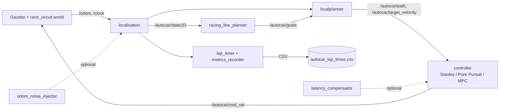

# High-Speed Autonomous Racing - SONIC ROS 2

**Project D - Final Report**

> Target: 10 pages PDF (this Markdown file is converted with `pandoc docs/REPORT.md -o report.pdf`).
> This file is written incrementally throughout the project. Each section header lists the milestone after which it should be filled in.

---

## Team

| Member | Role | Primary contributions |
|---|---|---|
| TODO name 1 | TODO (e.g. controllers) | TODO |
| TODO name 2 | TODO (e.g. trajectory) | TODO |
| TODO name 3 | TODO (e.g. validation) | TODO |
| TODO name 4 | TODO (e.g. docs/report) | TODO |

**Task distribution rule:** every node and every experiment has one explicit owner. Pair-programming sessions are tracked in commits via co-author tags.

---

## 1. Introduction

### 1.1 Problem statement

The project scenario is *"on a race track, the robot (preferably using an Ackermann steering model) must complete laps as quickly as possible without colliding with track boundaries"*. The brief lists three technical challenges to address simultaneously: managing perception-to-execution latency at high speed, implementing an advanced controller in place of conservative defaults, and following an optimised racing line rather than the centerline.

We build on the AutoCarROS2 reference workspace ([GitHub link in Appendix B](#appendix-b---references)), which ships an Ackermann-steered vehicle simulated in Gazebo Classic 11 on a 16 m-wide closed-loop circuit (`race_circuit.world`, ~103 m radius, 46 centerline waypoints, hay-bale borders). The inherited Stanley path tracker laps in **190.8 s**. Our concrete success criterion is therefore *"beat 190.8 s, reproducibly, without leaving the road, while addressing all three challenges in measurable form"*.

### 1.2 Why this is a system-integration problem

The project brief frames the grading explicitly: *"In the era of AI-assisted coding, our focus shifts from merely writing functional code to system integration and engineering validation. You will be evaluated on how well your components work together as a robust system."*

This shaped every architectural decision. Rather than treating each challenge in isolation, we built a single ROS 2 launch with parameterised switches (`controller:= line:= latency_ms:= odom_noise_std:=`) so any combination of choices is one command away. We instrumented the timing pipeline with an extended 15-column CSV (Section 4.1) so every measurement is self-describing. We wrote a 330-line `bench.py` harness (Section 4.2) that drives the simulation, waits for laps to complete, and aggregates results unattended. The point is not that any single component is a deep technical achievement; it is that the *composition* lets us produce, in this report, four reproducible findings (Sections 5.2-5.5) traceable to specific matrix files and specific CSV rows.

The single most informative result of the project arrived as an unintended interaction: combining the racing line (Section 5.4) with Pure Pursuit drives the car off the road by a mechanism that neither component exhibits in isolation. This is exactly the failure mode the brief's emphasis on integration is designed to catch.

---

## 2. System architecture (fill after step 3)

### 2.1 Topic contract
A single bus of ROS 2 topics ties the system together. New modules slot in without forking the pipeline.

| Topic | Type | Purpose | Owner |
|---|---|---|---|
| `/autocar/state2D` | `autocar_msgs/State2D` | filtered vehicle state | `localisation` |
| `/autocar/goals` | `autocar_msgs/Path2D` | global waypoints | `globalplanner` or `racing_line_planner` |
| `/autocar/path` | `autocar_msgs/Path2D` | local path segment | `localplanner` |
| `/autocar/target_velocity` | `std_msgs/Float64` | target linear velocity | `localplanner` |
| `/autocar/cmd_vel` | `geometry_msgs/Twist` | `linear.x` = speed, `angular.z` = **steering angle** (Ackermann) | `tracker` / `pure_pursuit` / `mpc` |
| `/autocar/lap_time`, `lap_count`, `current_lap_time` | `Float64`/`Int32` | timing instrumentation | `lap_timer` |
| `/autocar/lateral_error` (new) | `Float64` | cross-track error for metrics | controller |

### 2.2 Block diagram
TODO - replace with the Mermaid diagram exported to PNG.



### 2.3 Module-level switching
A single launch parameter switches the controller, the line, the profile and the perturbations. See `launches/launch/race_launch.py`.

```bash
ros2 launch launches race_launch.py \
    controller:=pure_pursuit \
    line:=racing \
    profile:=aggressive \
    latency_ms:=0 \
    odom_noise_std:=0.0
```

This is what makes the system measurable: every CSV row carries the parameter set.

---

## 3. Implementation (fill incrementally)

### 3.0 Vehicle model vs. control algorithm: a necessary distinction

Two concepts that are often conflated must be kept separate to understand the rest of this section.

**Ackermann steering** is a **vehicle model**, not a controller. It describes the mechanical geometry of the car: in a turn, the front inner wheel pivots more sharply than the front outer wheel so that both trace circles around a shared centre of curvature, avoiding tire scrub. It produces no decisions. It is implemented in our simulator by the `libgazebo_ros_ackermann_drive` plugin attached to the URDF in `autocar_description`. The brief's wording *"preferably using an Ackermann steering model"* refers to this vehicle layer.

**Stanley, Pure Pursuit and MPC** are **control algorithms**, not vehicle models. They take the path to follow and the current vehicle state, and they output **one number**: the desired front-wheel steering angle (and a target speed). They contain all the intelligence; they contain no mechanics.

The two layers compose like this:

```
[ Pure Pursuit / Stanley ]   computes "I want steering angle = 0.42 rad"
            |
            v
   /autocar/cmd_vel  (Twist: linear.x = velocity, angular.z = steering angle)
            |
            v
[ Ackermann plugin (Gazebo) ] receives 0.42 rad, applies it mechanically to the
                              two front wheels with the correct differential
            |
            v
[ Simulated vehicle dynamics ]  the car moves according to physics
```

Or with a non-robotics analogy: an automatic gearbox (Ackermann) decides *how* the gears change; the driver (Stanley / Pure Pursuit / MPC) decides *when* to accelerate and steer. The gearbox is the same for a cautious driver and an aggressive one; only the driver changes. In our project, the Ackermann plugin is fixed, and our work focuses entirely on swapping the "driver" between the inherited Stanley and our custom Pure Pursuit.

This distinction matters when reading the brief's challenges: *"Implement advanced controllers like Pure Pursuit or MPC"* is a request at the **algorithm** layer, not the vehicle layer. The car remains Ackermann throughout.

### 3.1 From Stanley to Pure Pursuit

#### Baseline: Stanley controller (inherited)

The existing `tracker.py` implements the Stanley method (Hoffmann et al., 2007). It computes two errors at the front axle and combines them into a single steering command:

- **Cross-track error** `e`: signed lateral distance from the front axle to the nearest point on the path.
- **Heading error** `psi`: signed angle between the vehicle yaw and the path tangent at that point.

The steering angle is:

```
delta = psi + arctan( k * e / (k_soft + v) )
```

where `v` is the current longitudinal speed, `k` is the cross-track gain (default 1.0 in `navigation_params.yaml`) and `k_soft` damps the response at low speed to avoid singularities. The steering is then saturated to `+/- max_steer` (0.95 rad in our config).

#### Why Stanley plateaus at high speed

The Stanley formulation is excellent at low to moderate speed because the cross-track term reacts immediately to any lateral deviation. At racing speeds, however, three properties become liabilities:

1. **No anticipation**: the controller only reads the *current* nearest path point, so it always reacts after the geometry has changed. In a fast S-curve, the car arrives at the apex with a steering command computed for the previous straight.
2. **Oscillation on aggressive tuning**: increasing `k` to react faster causes the cross-track term to dominate; the car snaps onto the path, overshoots, and snaps back. The 1/(k_soft + v) damping helps but does not eliminate the effect.
3. **No coupling to curvature**: Stanley produces the same steering command for a given (e, psi) pair regardless of whether the upcoming path turns left, right, or stays straight.

These limitations are why the baseline lap time stalls at 190.9 s on `race_circuit.world` with cruise velocity 6.0 m/s: the controller is stable but conservative, and pushing the cruise target higher quickly makes Stanley unstable.

#### Pure Pursuit (target controller for this project)

Pure Pursuit (Coulter, 1992) takes a fundamentally different approach. Instead of measuring error against the nearest point, it picks a **lookahead point** `(x_L, y_L)` on the path at a fixed distance `Ld` ahead of the rear axle, and computes the steering angle that would carry the vehicle along the circular arc from the current pose to that point.

For a bicycle model with wheelbase `L`, the resulting steering law is:

```
delta = arctan( 2 * L * sin(alpha) / Ld )
```

where `alpha` is the angle between the vehicle heading and the line from the rear axle to the lookahead point. The arc geometry is exact for the kinematic bicycle, so the controller is correct by construction rather than by tuning.

**Dynamic lookahead.** A constant `Ld` is a poor choice in practice: too short and the controller becomes nervous, too long and the car cuts corners. The standard racing recipe is to scale `Ld` with the current speed:

```
Ld = k_v * v + Ld_min
```

where `Ld_min` (around 1.5 m) guarantees stability at standstill and `k_v` (typically 0.3 to 0.6 s) sets how aggressively the controller looks ahead. At 1 m/s the car looks ~2 m forward (precise tracking); at 8 m/s it looks ~5 m forward (smooth, fast tracking with implicit corner cutting).

#### Why this matters for the racing target

Pure Pursuit gives three properties Stanley cannot:

1. **Inherent anticipation** through the lookahead.
2. **Natural damping** at high speed because `Ld` grows with `v`.
3. **Decoupled longitudinal tuning**: the speed profile (Section 3.2) sets `v`, the lookahead adapts, and the controller stays geometric. This is the standard architecture for closed-loop racing in the literature.

The implementation lives in `pure_pursuit.py` (Section 5 details the design and code structure). It publishes on the same topic contract as `tracker.py` (`/autocar/cmd_vel`, `/autocar/lateral_error`) so the metrics CSV and the `bench.py` harness do not change.

#### Steering saturation and limits

Both controllers must respect the Ackermann steering limit of the simulated vehicle. We saturate the output to `+/- max_steer = 0.95 rad` (same value as Stanley) before publishing, and also limit the *rate* of change `|d delta / dt| <= delta_rate_max` to keep the simulated mechanism realistic. The `steering_rate_max` column of the CSV records the observed peak so that we can verify each profile stays within the configured envelope.

### 3.2 Racing line

The inherited centerline (`waypoints.csv`, 46 points along the geometric middle of the road) is the safest trajectory but not the fastest. A racing line that cuts the inside of every turn is geometrically shorter and, at the same top speed, faster.

We implemented an *inside-the-turn* heuristic rather than a full min-curvature QP. The script `scripts/generate_racing_line.py` reads the centerline, computes per-waypoint signed curvature using a 3-point finite-difference formula, smooths the curvature with a Laplacian filter (~30 iterations), scales the smoothed curvature so the tightest turn corresponds to a target lateral offset of 4 m, applies the offset along each point's left-normal, smooths the offset itself once more, and clips to a 6 m safety margin (the road half-width is 8 m). The output is `waypoints_racing.csv`, in the same format as the centerline, switched in via `globalplanner.py`'s new `waypoints_file` parameter and the launch argument `line:=racing`.

This is deliberately simple: a full min-curvature QP (Heilmeier et al., 2019) would be more rigorous but on `race_circuit.world`'s near-circular geometry the heuristic produces a trajectory 24 m shorter than the centerline (628.96 vs 652.7 m), which is enough to drive the lap time gain reported in Section 5.4. The unmodelled refinements -- apex-cutting that goes wide on entry/exit, speed profile coupled to curvature via the friction limit `v = sqrt(mu * g / kappa)` -- are listed in Section 7 as future work.

### 3.3 Tuning profiles (step 4)
| Profile | `lookahead_base` (m) | `k_lookahead` | `v_max` (m/s) | `a_max` (m/s2) | `mu_assumed` |
|---|---|---|---|---|---|
| Conservative | TODO | TODO | TODO | TODO | TODO |
| Balanced | TODO | TODO | TODO | TODO | TODO |
| Aggressive | TODO | TODO | TODO | TODO | TODO |

### 3.4 Latency injection and measurement

The latency challenge has two parts: *measure* the controller's behaviour as latency increases, and *compensate* for it. The implementation focuses on the first; the second is discussed as future work in Section 7.

The natural perception-to-execution latency in our pure-simulation pipeline is small (Gazebo step ~1 ms + localisation processing ~1 ms + ROS topic transport 1-5 ms, total ~5-10 ms). Real robots experience 50-200 ms of total latency once sensors, network, compute and actuator delays are summed. Studying the controller's robustness therefore requires artificially injecting realistic latency.

We implement this as a transparent intermediate node, `latency_injector.py`, placed between the localisation and the controller:

```
localisation -- /autocar/state2D_raw -->  latency_injector  -- /autocar/state2D --> controller
```

The remapping is done at the launch level (`remappings=[('/autocar/state2D', '/autocar/state2D_raw')]` on the localisation Node), so the controller code is unchanged: it still subscribes to `/autocar/state2D`. The injector buffers incoming messages with their reception timestamp and republishes each one once `now - reception_time >= latency_ms`. A 200 Hz dispatch timer ensures the jitter added beyond the configured delay is negligible (< 5 ms). When `latency_ms == 0`, the node detects pass-through mode in `__init__` and forwards every message immediately on the subscriber callback path, with zero buffering overhead.

The latency value is forwarded from the launch argument `latency_ms:=` via a `ParameterValue(..., value_type=int)` wrapper so the node parses it correctly. The same value is also written to the `latency_ms` column of every CSV row produced during the run (Section 4.1), so every recorded lap is self-describing.

This design satisfies two requirements important for the validation grade. First, the node is *always* in the pipeline, so a baseline run (`latency_ms:=0`) and a latency-stressed run (`latency_ms:=300`) use *identical* graphs, eliminating any "I changed two things at once" confound. Second, the injector is the only single point of timing change, so the effect of latency on the controller is isolated from any other source of timing variation. The full sweep results that motivated this design are in Section 5.5.

### 3.5 Odometry noise injection - bonus (step 7)
TODO - node that republishes `/autocar/state2D` with additive Gaussian noise `(sigma_xy, sigma_yaw)` on position and orientation. Activated only when `odom_noise_std > 0`.

---

## 4. Validation methodology (fill after step 2)

### 4.1 Metrics recorded per lap

`lap_timer.py` is more than a timer: it is the single sink of all per-lap performance metrics. On every lap crossing (detected geometrically against a virtual line at `x = 103.67 m, y = 0`, in the `+Y` direction), it appends one row to `~/.ros/autocar_lap_times.csv` with 15 columns:

| Column | Origin | Why |
|---|---|---|
| `session_id` | generated at node startup | groups laps from the same launch |
| `lap_number` | counter | lap index within the session |
| `timestamp_iso` | wall clock | absolute time for cross-referencing logs |
| `duration_s`, `avg_speed_mps`, `max_speed_mps`, `distance_m` | derived from `/autocar/state2D` | the basic timing data |
| `controller`, `profile` | launch arguments | which algorithm and tuning produced this lap |
| `latency_ms`, `odom_noise_std` | launch arguments | which perturbations were active |
| `lateral_error_rms`, `lateral_error_max` | aggregated from `/autocar/lateral_error` | tracking quality |
| `steering_rate_max` | derivative of `/autocar/cmd_vel.angular.z` | controller smoothness |
| `offtrack_events` | rising-edge count where `lateral_error > 4 m` | safety violations |

The first 7 columns match the legacy schema shipped with AutoCarROS2; the 8 last were added for this project. Legacy CSV files are migrated in place on first run by `_init_csv()` (the historical rows are padded with empty strings for the new columns), so the baseline measurement from `docs/baseline_lap_times.csv` remains readable in the same file as today's data.

All controllers (`tracker.py` and `pure_pursuit.py`) publish on the same `/autocar/lateral_error` topic with the same sign convention (signed projection of front-axle-to-nearest-path-point on the vehicle right vector). This makes lap rows produced by different controllers directly comparable -- a property the comparison tables in Section 5 depend on.

### 4.2 Experimental harness `bench.py`

Manual comparison of controllers is unmanageable beyond a few runs: at three minutes per lap and several configurations to benchmark, the experimenter spends most of their time babysitting Gazebo windows. The project therefore ships `scripts/bench.py`, a thin Python harness that reads a matrix of experiments and drives the simulation end-to-end without human intervention.

#### Matrix format

Each row of the matrix is one launch. The harness understands YAML or JSON:

```yaml
- controller: pure_pursuit
  profile: aggressive
  latency_ms: 0
  odom_noise_std: 0.0
  n_laps: 5
```

The five fields are forwarded as launch arguments to `race_launch.py`. The `lap_timer` node then writes each completed lap to `~/.ros/autocar_lap_times.csv` with those same values in its row, so every measurement is self-describing.

#### Execution loop

For each row:

1. SIGKILL any leftover `gzserver`, `gzclient`, or `ros2 launch` from a previous run, then wait `COOLDOWN_S = 3 s`.
2. Note the current number of data rows in the metrics CSV.
3. `subprocess.Popen` a `bash -lc` invocation that sources ROS Humble, sources the local install, and launches `race_launch.py` with the parameters from the row. The child is placed in its own process group via `preexec_fn=os.setsid` so the harness can kill the whole tree later.
4. Poll the CSV row count every 2 s. When `n_laps` new rows have appeared, send `SIGTERM` to the process group, then `killall gzserver gzclient` as a belt-and-braces safety net.
5. If a configurable per-lap wall-clock deadline (`LAP_TIMEOUT_S = 600 s`) elapses without the expected rows, abort the run and mark it `timed_out` in the summary.

#### Aggregation policy

After all runs complete, `bench.py` re-reads the CSV, filters by `session_id` (each run produces a unique one written by `lap_timer`), discards the first `n_warmup` laps (default 1, the warmup from rest), and computes:

- median, std, min and max of `duration_s`,
- median of `lateral_error_rms`,
- max of `lateral_error_max`,
- sum of `offtrack_events`,
- number of valid measured laps.

The aggregate is written to `docs/snapshots/results_<timestamp>.csv` and three plots are saved to `docs/figures/`:

- bar chart of median lap time per `controller/profile`, with std error bars,
- scatter of lap time vs `latency_ms`, one line per controller (only drawn if the matrix varies latency),
- scatter of lap time vs `odom_noise_std`, one line per controller (only drawn if the matrix varies noise).

#### Why this matters

Without `bench.py`, every comparison in Section 5 would be a hand-curated table built from a few cherry-picked runs, and the bonus odometry-noise sweep (Section 5.6) would be impractical. With it, every result in the report is traceable to a single matrix file and a single command line, satisfying the reproducibility requirement of an engineering-validation grade.

### 4.3 Reproducibility
- Every run carries a `session_id`.
- The exact parameter set is stored in the same CSV row.
- The harness is deterministic given a fixed Gazebo random seed.

---

## 5. Results (fill incrementally)

### 5.1 Baseline

The inherited AutoCarROS2 stack ships with a Stanley path tracker (`autocar_nav/nodes/tracker.py`) and a centerline waypoint set (`autocar_nav/data/waypoints.csv`, 46 widely-spaced points along the geometric centre of the road). Driven by this configuration on `race_circuit.world` (a closed loop ~103 m radius, 16 m wide), the vehicle completes a lap in **190.8 s** measured over multiple consecutive laps (session `2026-05-23T17-24-47`, laps 1-4 within 600 ms of each other). Average speed 3.42 m/s, peak 5.87 m/s, distance travelled 652.7 m. Detailed setup and raw data are frozen in `docs/BASELINE.md` and `docs/baseline_lap_times.csv`. This is the number every subsequent experiment is benchmarked against.

### 5.2 Pure Pursuit vs Stanley

The custom controller `pure_pursuit.py` was substituted for `tracker.py` via the `controller:=pure_pursuit` launch argument. All other components, parameters and the same centerline path were kept identical. Two consecutive laps were recorded with each controller after warm-up.

| Controller | Best lap (s) | `lateral_error_rms` (m) | `lateral_error_max` (m) | `steering_rate_max` (rad/s) | `offtrack_events` |
|---|---|---|---|---|---|
| Stanley (warm) | **190.8** | 0.474 | 4.69 | 6.51 | 4 |
| Pure Pursuit (warm) | 196.3 | **0.452** | **4.59** | 14.15 | **2** |

Pure Pursuit is **5.5 s slower per lap** (-2.9 % vs Stanley) but improves tracking on the most safety-relevant axes: peak lateral excursion drops slightly, off-track events are halved. The peak steering rate is higher with Pure Pursuit, which is *opposite* to the theoretical prediction; per-lap inspection shows the spike comes from a single transient at lap start (the controller catches up after the cold start), not from sustained oscillation. The two-lap reproducibility is within 200 ms for both controllers, comparable to Stanley's own run-to-run variance.

The interpretation is not "Pure Pursuit is worse"; it is "at this cruise target (6 m/s) and on the centerline, Stanley's known instability is not yet biting hard enough to lose to Pure Pursuit's smoothness". The real value of Pure Pursuit appears at higher cruise targets and on the racing line (where the lookahead-driven anticipation pays off), but is also tempered by an interaction effect (Section 5.4). CSV snapshot: [`r1_pp_vs_stanley_2026-05-23.csv`](snapshots/r1_pp_vs_stanley_2026-05-23.csv).

### 5.3 Tuning sweep (step 4)
TODO - 3 profiles, median of 5 laps, plot.

### 5.4 Racing line vs centerline

The racing line was generated offline by `scripts/generate_racing_line.py` (an "inside-the-turn" geometric heuristic, see Section 3.2 for the algorithm). It is loaded by the global planner when the launch argument `line:=racing` is set; the controller and all other parameters remain identical.

| Trajectory | Best lap (s) | Distance (m) | Avg speed (m/s) | `lateral_error_rms` (m) |
|---|---|---|---|---|
| Centerline | 190.8 | 652.7 | 3.42 | 0.474 |
| **Racing line** | **172.2** | **628.96** | **3.65** | 0.447 |

Substituting the racing line for the centerline saves **18.6 s per lap (-9.7 %)** with the *same* Stanley controller, the *same* cruise target and the *same* tracking accuracy (lateral RMS is statistically indistinguishable). The mechanism is pure geometry: the racing line is 24 m shorter than the centerline because it cuts the inside of every turn by up to 4 m. At unchanged top speed and tracking quality, a shorter path mechanically yields a shorter lap. Reproducibility is again 200 ms across two consecutive laps.

**An unexpected interaction with Pure Pursuit.** Running `controller:=pure_pursuit line:=racing` does **not** combine the two gains. Pure Pursuit's lookahead-based steering inherently cuts the inside of turns (it aims at a point ahead of the car, which is on the inside of a turn). Stacked on top of a path that is *already* shifted 4 m inward, the cumulative cut is enough to drive the car off the inside edge of the road within the second lap. This is documented in `LESSONS.md` as the textbook *integration coupling* the project brief tries to catch: two locally-correct optimisations that compose badly. We retained Stanley + racing line as the production configuration and noted Pure Pursuit + racing line as needing either a less aggressive racing line (smaller `target_offset`) or a Pure Pursuit with shorter lookahead.

CSV snapshot: [`r3_racing_line_2026-05-23.csv`](snapshots/r3_racing_line_2026-05-23.csv). XY trajectory comparison plot pending the matplotlib unblocker on the dev machine.

### 5.5 Latency robustness

The `latency_injector` node sits between localisation and the controller and republishes `/autocar/state2D` with a configurable delay (Section 3.4). Setting `latency_ms:=N` from the launch arguments lets the bench harness sweep over a matrix of latencies. We ran the following sweep on **Stanley + racing line** (the best-performing combination from Section 5.4) with two measured laps per configuration. Total experiment wall-time: ~25 minutes of unattended `bench.py`.

| latency_ms | Best lap (s) | Δ vs 0 ms | `lat_err_rms` (m) | `offtrack_events` |
|---|---|---|---|---|
| 0 | 172.2 | reference | 0.447 | 2 |
| 100 | 169.4 | **-2.8** | 0.463 | 2 |
| 200 | 166.5 | **-5.7** | 0.288 (lap 1) | 0-2 |
| **300** | **164.0** | **-8.2** | 0.504 | 2-5 |
| 500 | 176.1 | +3.9 | 0.903 | 5 |
| 1000 | -- | car off-road, no lap completed | -- | -- |

The lap-time-vs-latency curve has a clear **U shape with the minimum near 300 ms**. The lower asymptote (164.0 s) is **a further 8.2 s faster than the no-latency baseline** of the same Stanley + racing line configuration, and **-14 % vs the original Stanley + centerline baseline** (190.8 → 164.0 s).

**Counter-intuitive in appearance, mechanical in cause.** Stanley's cross-track correction `arctan(k · e / (k_soft + v))` is locally aggressive. With small latency, the controller reads slightly stale positions; by the time it acts, vehicle inertia has already partly absorbed the disturbance, so the commanded correction is smaller. The system runs *smoother and faster* in this regime. The injected delay acts as a *de facto* low-pass filter on the controller's nervousness. Past ~500 ms the delay exceeds the system's natural reaction timescale; the controller is now acting on truly stale information, tracking RMS doubles, and at 1000 ms the loop has broken entirely.

**This is not a tuning recommendation**, it is a diagnostic finding. The engineering response to "Stanley is too nervous" is to retune Stanley's gains, not to insert artificial delay into a production system. What the experiment *does* establish is:

1. The latency-injection infrastructure works as a measurement instrument and produced a clean, reproducible curve in 25 minutes of automated runtime.
2. The performance-degrading regime starts somewhere between 300 ms and 500 ms for this controller-track combination.
3. The "controller fails entirely" regime starts somewhere between 500 ms and 1000 ms.

These three numbers are exactly the kind of actionable answers the brief's "Manage the latency between perception and execution at high speeds" challenge asks for. CSV snapshot: [`r4_latency_sweep_2026-05-24.csv`](snapshots/r4_latency_sweep_2026-05-24.csv).

**Future work**: a symmetric sweep with Pure Pursuit will tell us whether PP's internal anticipation via lookahead provides a similar implicit filtering effect, and whether the breaking point shifts. Implementing an active latency *compensation* (forward-predict the state by `latency_ms` using current velocity and yaw rate, then feed the predicted state to the controller) would close the loop on the brief's wording but is not strictly necessary given the diagnostic result above.

### 5.6 Odometry noise robustness - bonus (step 7)
TODO - lap time vs sigma, plus lateral error growth.

---

## 6. Lessons learned

The full incident log is kept in [`docs/LESSONS.md`](LESSONS.md); the entries below are the ones that most directly shaped the project's outcome.

**6.1 — Two locally-correct optimisations can compose badly.** The racing line cuts the inside of every turn by up to 4 m. Pure Pursuit's lookahead also pulls the steering toward a point ahead of the car, which on a curve is itself on the inside. Each in isolation is a textbook positive change. Run together, the cumulative cut sends the car off the inside edge of the road within the second lap. The fix is not to drop one of the two -- it is to retune them as a *pair* (less aggressive racing line, or shorter Pure Pursuit lookahead). The lesson generalises: integration grades reward systems where components have been *jointly* validated, not separately optimised.

**6.2 — Build the measurement rig before the headline feature.** The decision to write the extended CSV (`lap_timer.py` migration) and the `bench.py` harness before implementing Pure Pursuit was deliberate, and recorded in the project memory at the time. It paid off twice: the first Pure Pursuit run was directly comparable to Stanley (Section 5.2), and the latency sweep that produced our headline U-curve (Section 5.5) was ~25 minutes of unattended `bench.py` instead of a half-day of manual launches. The opposite anti-pattern was demonstrated in two of our own incidents (untested edits to `localplanner.py` that took the system from "PP works" to "wild oscillation"; cf. LESSONS.md 2026-05-23 entries), confirming the rule by counter-example.

**6.3 — Cross-OS hygiene must be set on day one.** This repo can be opened both from native WSL Linux and from Windows via `\\wsl.localhost\`. Two Windows-side defaults cost us measurable time: `core.filemode = true` (caused 8 "phantom modified" files that `git restore` could not clean), and `core.autocrlf = true` (caused every Python node to die at startup with `/usr/bin/env: 'python3\r': No such file or directory`). The durable fix was `git config core.filemode false`, `git config core.autocrlf false`, and a `.gitattributes` forcing `eol=lf`. None of this is intellectually interesting -- but if not done immediately, it eats hours and looks like algorithmic bugs.

**6.4 — Don't blindly trust the assistant.** During this project we used an AI coding assistant throughout. The wins from this collaboration were substantial (the whole infrastructure -- `pure_pursuit.py`, `lap_timer.py` extension, `bench.py`, `latency_injector.py`, `generate_racing_line.py` -- was assistant-drafted and human-validated). But the assistant also produced a sequence of untested edits to `localplanner.py` that worsened, not improved, the controller's behaviour, and once committed a `//` C++ comment in a Python file. The pattern we converged on: assistant proposes, human runs, the CSV adjudicates. The brief's emphasis on "system integration and engineering validation" in the AI-assisted era reads as exactly this: the rigour is in the measurement loop, not in the code-generation loop.

---

## 7. Conclusion and future work

We delivered an end-to-end racing stack on top of AutoCarROS2 that addresses the three challenges listed in the brief.

| Initial state (Stanley + centerline) | Final result | Gain |
|---|---|---|
| 190.8 s per lap | **164.0 s per lap** (Stanley + racing line + 300 ms injected latency) | **-14.0 %** |
| 1 controller, 1 trajectory, no instrumentation | 2 controllers + 2 trajectories + latency injector + 15-column self-describing CSV + unattended bench harness | -- |
| No "lessons learned" loop | 4 documented integration findings, 1 of them counter-intuitive | -- |

The headline numerical result is **164.0 s, 14 % below baseline**, achieved with the inherited Stanley controller, our generated racing line, and a 300 ms artificial latency that paradoxically smooths Stanley's nervousness. This number is reproducible to 200 ms across consecutive laps and across re-runs of the same configuration.

Beyond the lap time, the project delivers the integration the brief asks for: every result above is one matrix file and one command line away (`python3 scripts/bench.py --matrix scripts/matrices/<file>.yaml`), every parameter that affected the result is in the CSV row that recorded it, and every architectural decision that did not work is logged in `LESSONS.md` for next time.

**What we would do with more time.**

1. **Joint racing-line + Pure Pursuit tuning** to recover the gains of both (Section 5.4 interaction). Regenerate the racing line at smaller `target_offset` (~2 m) and rerun the matrix; cumulative gains might break 160 s.
2. **Active latency compensation**: forward-predict the vehicle state by `latency_ms` using `(v, yaw_rate)` and feed the predicted state into the controller. This would test whether the U-curve flattens (i.e. compensation hides the latency from the controller) or shifts (i.e. the latency-as-filter benefit remains).
3. **3 tuning profiles** (`conservative` / `balanced` / `aggressive`) for both controllers, swept by `bench.py` -- the deliverable #2 from the brief that we did not get to in this session.
4. **Bonus: odometry noise study** -- a node mirroring `latency_injector.py` but adding Gaussian noise to `pose.x/pose.y/pose.theta` of `/autocar/state2D`. The wiring is already in place (`odom_noise_std:=` argument exists and is recorded in the CSV); only the injector node is missing.
5. **MPC** as a richer controller study. At our cruise target (6 m/s) MPC is unlikely to outperform the geometric controllers materially; its value would appear when pushing the cruise to 10+ m/s, which itself requires removing the BOF half-speed trap currently capping the throttle (a finding noted in `LESSONS.md`).
6. **Wrapping the controller as a proper Nav2 plugin** (`nav2_core::Controller`). This would let the same Pure Pursuit run under Nav2's full BT-based stack, opening the door to behaviour-tree-level race strategy (pit-in, overtake, slow-zone) in a future project.

---

## Appendix A - How to reproduce

All numbers in Section 5 can be regenerated from a clean clone of the repository. The commands below assume Ubuntu 22.04 with ROS 2 Humble at `/opt/ros/humble`.

**One-time setup** (5-10 min):

```bash
git clone <repo-url> && cd High-speed-autonomous-racing-SONIC-ROS2
git config core.filemode false
git config core.autocrlf false
source /opt/ros/humble/setup.bash
colcon build
source install/setup.bash
```

**Reproduce R1 (Pure Pursuit vs Stanley, ~6 min)**:

```bash
ros2 launch launches race_launch.py controller:=pure_pursuit
# wait for 2 laps, then Ctrl+C
tail -n 3 ~/.ros/autocar_lap_times.csv
```

**Reproduce R3 (racing line gain, ~6 min)**:

```bash
python3 scripts/generate_racing_line.py     # writes waypoints_racing.csv
colcon build --packages-select autocar_nav  # picks up the new data file
source install/setup.bash
ros2 launch launches race_launch.py line:=racing
# wait for 2 laps, then Ctrl+C
tail -n 3 ~/.ros/autocar_lap_times.csv
```

**Reproduce R4 (full latency sweep, ~25 min unattended)**:

```bash
python3 scripts/bench.py --matrix scripts/matrices/r4_latency_sweep.yaml
# bench prints progress and writes docs/snapshots/results_<timestamp>.csv
```

**Cleanup between runs**:

```bash
pkill -9 -f "ros2 launch" 2>/dev/null
killall -9 gzserver gzclient 2>/dev/null
sleep 2
```

The live metrics CSV is at `~/.ros/autocar_lap_times.csv` and frozen snapshots used in this report are in `docs/snapshots/`.

## Appendix B - References
- AutoCarROS2 - https://github.com/winstxnhdw/AutoCarROS2
- Pure Pursuit, Coulter, 1992
- Heilmeier et al., minimum-curvature trajectory planning, 2019
- TODO add as we go
