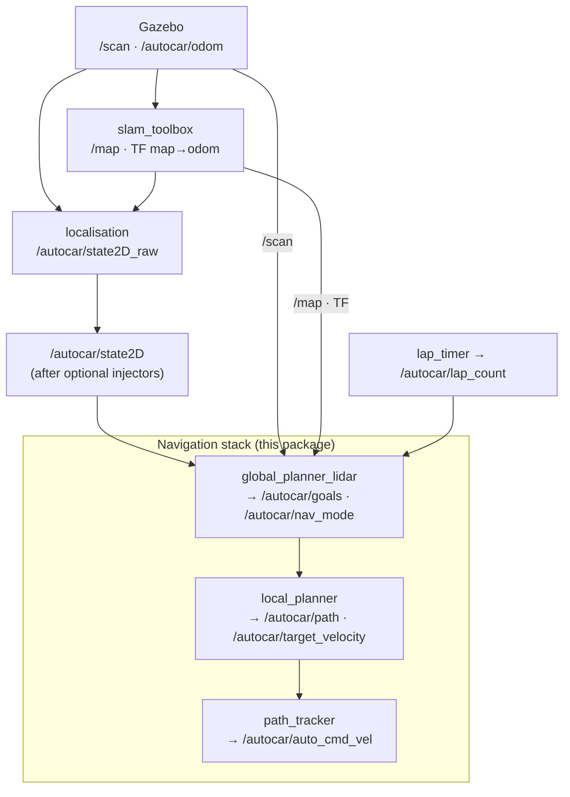

# autocar_nav_pure_pursuit_lidar

LiDAR + SLAM driven Pure Pursuit navigation stack. Two phases in a single simulation session:


| Phase                   | Trigger                                | Path source                                                    |
| ----------------------- | -------------------------------------- | -------------------------------------------------------------- |
| **Lap 1 — exploration** | `/autocar/lap_count < 1`               | Live LiDAR + SLAM `/map` → local corridor centerline           |
| **Lap 2+ — racing**     | `/autocar/lap_count == 1` (built once) | Lap-1 SLAM map → centerline → min-curvature → Laplacian smooth |


No precomputed waypoint CSV; the map stays in memory only (`slam_toolbox` does not save to disk).

---

## Data flow

### Overview

One-way pipeline: **pose + sensors → `/autocar/goals` → `/autocar/path` → Pure Pursuit cmd**. Lap 1 builds the SLAM map while following live LiDAR goals; when `/autocar/lap_count` reaches 1, `global_planner_lidar` builds a cached racing line from that map and switches `/autocar/nav_mode` to racing.




Each stack node also subscribes to `/autocar/state2D` for pose; only the primary data chain is drawn above.


| Stage   | Node (package)                    | Main inputs                                                     | Main outputs                                |
| ------- | --------------------------------- | --------------------------------------------------------------- | ------------------------------------------- |
| SLAM    | `slam_toolbox`                    | `/scan`, odom TF                                                | `/map`, `map→odom` TF                       |
| Pose    | `localisation` (this pkg)         | `/autocar/odom`, SLAM TF                                        | `/autocar/state2D_raw`                      |
| Goals   | `global_planner_lidar` (this pkg) | `/autocar/state2D`, `/scan`, `/map`, `/autocar/lap_count`       | `/autocar/goals`, `/autocar/nav_mode`       |
| Path    | `local_planner` (this pkg)        | `/autocar/state2D`, `/autocar/goals`, `/autocar/nav_mode`       | `/autocar/path`, `/autocar/target_velocity` |
| Control | `path_tracker` (this pkg)         | `/autocar/state2D`, `/autocar/path`, `/autocar/target_velocity` | `/autocar/auto_cmd_vel`                     |


Optional nodes from `autocar_nav` (latency / odom noise injectors, `lap_timer`, `control_manager`) sit between `/autocar/state2D_raw` and `/autocar/state2D`, or on the `/autocar/cmd_vel` path — see [Launch and external nodes](#launch-and-external-nodes).

### Lap 1 — exploration (`/autocar/nav_mode = 0`)

1. **Gazebo** publishes `/scan` and `/autocar/odom`.
2. `**slam_toolbox`** subscribes to `/scan` + odom TF, builds the map asynchronously, publishes `/map` (~1 Hz) and `map→odom` TF.
3. `**localisation**` composes `map→odom` and `map→base_link`, outputs SLAM-corrected `/autocar/state2D_raw`.
4. `**global_planner_lidar**` (10 Hz):
  - Calls `**centerline_extractor.extract_local_centerline**`, which prefers `**centerline_from_scan**` on `/scan`: for each goal distance `d`, finds the **largest contiguous arc of scan rays unobstructed at `d`** and places the goal at the arc's center angle. Near goals blend toward a mid-range look-ahead angle so gentle curves start steering before the outer wall enters the close-range arc.
  - Falls back to `**centerline_from_map**` (lateral ray casts on the occupancy grid) when scan is unavailable or too sparse; last resort is straight-ahead points along body heading.
  - Prepends two anchor points behind the car, aligned with the **first goal direction** (not raw body heading) so the cubic spline tangent at the car follows the corridor immediately.
  - Scan-based points are already in odom frame and are published directly (no extra frame transform); map-based points are transformed with live `map→odom` TF.
  - Publishes `/autocar/goals` (`Path2D` polyline).
5. `**local_planner`** cubic-splines `/autocar/goals` (`**cubic_spline_interpolator**`), limits speed by curvature (`exploration_velocity`), publishes `/autocar/path` and `/autocar/target_velocity`.
6. `**path_tracker**` runs `**pure_pursuit**` steering and throttle, publishes `/autocar/auto_cmd_vel` (remapped to `/autocar/cmd_vel` by default).

### Lap 2+ — racing (`/autocar/nav_mode = 1`)

Triggered exactly once when `/autocar/lap_count == 1` (from `**lap_timer**`). The racing line is built once from the lap-1 SLAM map and reused for all subsequent laps.

1. `**global_planner_lidar**` builds the racing line **in a background thread** so the car keeps receiving `/autocar/goals` (exploration) and continues to steer during the build (~0.5 s):
  - `**map_centerline.extract_loop_centerline_from_map`**: march the loop, then `**map_track_geometry.refine_closed_centerline_from_map**` re-snaps each vertex to the geometric midpoint between map ray-cast boundaries;
  - `**map_track_geometry.map_corridor_bounds_for_polyline**`: per-point left/right clearance from the grid (`racing_use_map_corridor`);
  - `**racing_line_mincurv.compute_mincurv_racing_line**`: min-curvature optimise inside the map-derived asymmetric corridor (not a fixed ±5 m);
  - `**racing_line_smooth.compute_smooth_racing_line**`: Laplacian polish, bounded by measured corridor half-width;
  - `**map_track_geometry.snap_racing_line_to_free_space**`: after mincurv + smooth, any point within `racing_boundary_margin` of an occupied cell (due to SLAM map gaps) is pulled back toward the nearest centerline point;
  - `**map_track_geometry.remove_fold_backs**`: strip single-step direction reversals >107° (loop-seam or snap artefacts; legitimate hairpins stay ≤40° per step);
  - Validates minimum point count after cleanup; caches `rx_map/ry_map` in the **map** frame.
2. At publish time, transforms the cached line to odom with **live** `map→odom` TF (matches `/autocar/state2D` after SLAM loop closure at the end of lap 1).
3. Tracks progress on the **front axle** (not CG). `closest_id` is initialised with `**closest_waypoint_index_closed_disambiguated`** (heading-aware full-loop search) so the first window is near the car even when mincurv/smooth resampling moved index 0. During driving, forward search is used first; if the nearest point is >6 m away, disambiguation re-runs to avoid locking onto a parallel straight on the wrong side of the track.
4. Sliding-window waypoints (`waypoints_ahead/behind`) use **wrapped index arithmetic** (`i % racing_n`). Two anchor points behind the car are prepended using **body heading** (not first-goal chord, which can cross the infield on parallel straights). `**_goal_polyline_ok`** rejects goal polylines with segment jumps that would make the cubic spline loop across the track; on rejection the planner keeps publishing `/autocar/goals` (exploration) until the next cycle.
5. `/autocar/nav_mode` stays **exploration** (and `exploration_velocity`) until the racing line is ready; then switches to racing in one step with anchors + nearest-window `/autocar/goals`.
6. Downstream `**local_planner`** / `**path_tracker**` unchanged except cruise speed uses `cruise_velocity` once `/autocar/nav_mode = 1`.

### `global_planner_lidar` — where to go

**Role:** decide *which route* the car should follow and publish a **sparse** polyline ahead of the vehicle. It does not smooth the path, plan speed, or send steering commands.

| Direction | Topic | Role |
|-----------|-------|------|
| Subscribe | `/autocar/state2D` | Current pose (odom) |
| Subscribe | `/scan` | Lap 1: gap-following corridor centerline |
| Subscribe | `/map` | Lap 1 fallback + lap 2+ racing-line build |
| Subscribe | `/autocar/lap_count` | Trigger one-time racing-line build when lap 1 completes |
| Publish | `/autocar/goals` | Sparse waypoint window (~7–12 points: anchors + sliding window) |
| Publish | `/autocar/nav_mode` | `0` = exploration, `1` = racing |
| Publish | `/autocar/viz_goals` | RViz debug |

**Lap 1:** live LiDAR/map centerline → `/autocar/goals` every 100 ms.

**Lap 2+:** build min-curvature + smoothed racing line once from the lap-1 SLAM map (background thread), then slide a wrapped window along that cached loop. Keeps publishing exploration `/autocar/goals` until the racing line is ready, then switches `/autocar/nav_mode` to `1`.

**Does not:** cubic spline interpolation, curvature speed limits, Pure Pursuit control, obstacle avoidance.

### `local_planner` — smooth path + speed

**Role:** bridge between sparse `/autocar/goals` and `path_tracker`. Turns the global polyline into a **dense, trackable** path and computes how fast the car may go.

| Direction | Topic | Role |
|-----------|-------|------|
| Subscribe | `/autocar/goals` | Sparse polyline from `global_planner_lidar` |
| Subscribe | `/autocar/state2D` | Pose for path anchoring and curvature look-ahead |
| Subscribe | `/autocar/nav_mode` | Pick base speed: `exploration_velocity` vs `cruise_velocity` |
| Publish | `/autocar/path` | Dense cubic-spline path (~0.1 m spacing, with yaw κ) |
| Publish | `/autocar/target_velocity` | Speed target after curvature cap + ramp |
| Publish | `/autocar/viz_path` | RViz debug |

**On each new `/autocar/goals` message:**

1. **Spline** — `cubic_spline_interpolator.generate_cubic_path` densifies the polyline (~10 Hz, `ds = 1/update_frequency`).
2. **Speed cap** — scans curvature ahead of the front axle: `v ≤ √(max_lateral_accel / κ)`; takes the minimum with the mode base speed (`exploration_velocity` or `cruise_velocity`).
3. **Ramp** — `apply_speed_ramp` limits accel/decel so `/autocar/target_velocity` changes smoothly.

**Does not:** choose the route (that is `global_planner_lidar`), steer the car (that is `path_tracker`), or avoid obstacles.

### Why not track `/autocar/goals` directly with Pure Pursuit?

`path_tracker` expects a dense `/autocar/path` with per-point yaw, not a sparse polyline:

| Issue | Sparse `/autocar/goals` | Dense `/autocar/path` |
|-------|-------------------------|------------------------|
| Lookahead | Arc-length interpolation jumps between 3–3.5 m segments → jerky steering | ~0.1 m spacing → smooth lookahead |
| Heading | Mostly `(x, y)` only; no reliable tangent for Frenet errors | Spline yaw at every point |
| Speed | No curvature profile | `local_planner` caps speed from κ ahead |

Splitting **route** (`global_planner_lidar`) → **smooth path + speed** (`local_planner`) → **control** (`path_tracker`) matches the classic ROS pattern and keeps tuning independent (e.g. `cruise_velocity` / `curvature_lookahead` vs `lookahead_gain`).

### Coordinate frames


| Frame       | Role                                                                                        |
| ----------- | ------------------------------------------------------------------------------------------- |
| `odom`      | RViz fixed frame; `/autocar/state2D`, `/autocar/goals`, and `/autocar/path` are in odom     |
| `map`       | SLAM map frame; centerline extraction and racing line are computed here                     |
| `base_link` | Vehicle body; `State2D.pose.theta` aligns with body +y, forward direction `(-sin θ, cos θ)` |


`**slam_pose.py**` handles 2D `map↔odom` transforms; consistent with the body-yaw convention in `**pure_pursuit.py**`.

---

## Package layout

```
autocar_nav_pure_pursuit_lidar/
├── CMakeLists.txt              # ament_cmake build; installs Python pkg, config, nodes
├── package.xml                 # ROS deps (no autocar_nav_pure_pursuit)
├── README.md
├── config/
│   ├── navigation_params.yaml  # per-node ROS parameters (see below)
│   └── slam_toolbox.yaml       # async SLAM: resolution, scan topic, loop closing, etc.
├── data/
│   └── .gitkeep                # reserved; no static map files currently
├── nodes/                      # ROS 2 executables (installed to lib/...)
│   ├── localisation.py
│   ├── global_planner_lidar.py
│   ├── localplanner.py
│   └── tracker.py
└── autocar_nav_pure_pursuit_lidar/   # importable Python library
    ├── __init__.py
    ├── centerline_extractor.py
    ├── cubic_spline_interpolator.py
    ├── map_centerline.py
    ├── map_track_geometry.py
    ├── map_localizer.py
    ├── normalise_angle.py
    ├── pure_pursuit.py
    ├── racing_line_mincurv.py
    ├── racing_line_smooth.py
    ├── slam_pose.py
    └── yaw_to_quaternion.py
```

### ROS nodes (`nodes/`)


| File                      | Node name              | Subscribes                                                      | Publishes                                                                 | Role                                                                                          |
| ------------------------- | ---------------------- | --------------------------------------------------------------- | ------------------------------------------------------------------------- | --------------------------------------------------------------------------------------------- |
| `localisation.py`         | `localisation`         | `/autocar/odom`                                                 | `/autocar/state2D_raw`                                                    | Wheel odometry + optional SLAM TF pose                                                        |
| `global_planner_lidar.py` | `global_planner_lidar` | `/autocar/state2D`, `/scan`, `/map`, `/autocar/lap_count`       | `/autocar/goals`, `/autocar/viz_goals`, `/autocar/nav_mode`               | Lap-1 scan/map goals; background racing-line build; sliding-window race goals with validation |
| `localplanner.py`         | `local_planner`        | `/autocar/goals`, `/autocar/state2D`, `/autocar/nav_mode`       | `/autocar/path`, `/autocar/viz_path`, `/autocar/target_velocity`          | Cubic spline path + curvature speed cap                                                       |
| `tracker.py`              | `path_tracker`         | `/autocar/state2D`, `/autocar/path`, `/autocar/target_velocity` | `/autocar/auto_cmd_vel`, `/autocar/lateral_error`, `/autocar/lateral_ref` | Pure Pursuit lateral + longitudinal control                                                   |


### Python library (`autocar_nav_pure_pursuit_lidar/`)


| File                           | Used by                                                 | Purpose                                                                                                                         |
| ------------------------------ | ------------------------------------------------------- | ------------------------------------------------------------------------------------------------------------------------------- |
| `centerline_extractor.py`      | `global_planner_lidar`                                  | Lap 1: `extract_local_centerline` → gap-following scan centerline or map ray casts                                              |
| `map_centerline.py`            | `global_planner_lidar`                                  | Lap 2+: closed-loop centerline from occupancy grid                                                                              |
| `map_track_geometry.py`        | `global_planner_lidar`                                  | Corridor refine, per-point boundary limits, `snap_racing_line_to_free_space`, `remove_fold_backs`                               |
| `racing_line_mincurv.py`       | `global_planner_lidar`                                  | Min-curvature racing line: `centerline + alpha * normal` within corridor                                                        |
| `racing_line_smooth.py`        | `global_planner_lidar`                                  | Laplacian polish after min-curv; validates curvature and track bounds                                                           |
| `pure_pursuit.py`              | `localplanner`, `tracker`, `global_planner_lidar`, etc. | Axles, closest point (incl. `closest_waypoint_index_closed_disambiguated`), lookahead, steering, curvature speed, Frenet errors |
| `cubic_spline_interpolator.py` | `localplanner`                                          | `generate_cubic_path(ax, ay, ds)` → dense `(x, y, yaw, κ)`                                                                      |
| `slam_pose.py`                 | `localisation`, `global_planner_lidar`                  | `slam_pose_in_odom`, `slam_pose_in_map`, `map_point_to_odom`                                                                    |
| `normalise_angle.py`           | `slam_pose`, `pure_pursuit`, `localisation`             | Wrap angle to -π, π                                                                                                             |
| `yaw_to_quaternion.py`         | `localplanner`, `tracker`                               | Quaternion for `/autocar/viz_path` / `/autocar/lateral_ref`                                                                     |
| `map_localizer.py`             | (unused)                                                | Brute-force scan-to-map pose correction; reserved                                                                               |
| `__init__.py`                  | external imports                                        | Exports `extract_local_centerline`, `generate_cubic_path`, `scan_match_pose`, `yaw_to_quaternion`                               |


### Config files (`config/`)

`**navigation_params.yaml**` — per-node namespaces:


| Namespace              | Key parameters                                                                                                          |
| ---------------------- | ----------------------------------------------------------------------------------------------------------------------- |
| `localisation`         | `use_slam`, `update_frequency`                                                                                          |
| `local_planner`        | `cruise_velocity`, `exploration_velocity`, `max_lateral_accel`, curvature lookahead                                     |
| `global_planner_lidar` | `exploration_goal_*`, `centerline_*`, `racing_*`, `waypoints_ahead/behind`, `waypoint_search_ahead`, `passed_threshold` |
| `path_tracker`         | `lookahead_gain/min/max`, `wheelbase`, `steering_limits`, `lateral_soft`                                                |


`**slam_toolbox.yaml**` — `scan_topic: /scan`, `map_frame: map`, `resolution: 0.2`, `map_update_interval: 1.0`, loop closing, etc.

### Build files


| File             | Description                                                            |
| ---------------- | ---------------------------------------------------------------------- |
| `CMakeLists.txt` | `ament_python_install_package` + installs 4 node scripts and `config/` |
| `package.xml`    | Depends on `autocar_msgs`, `slam_toolbox`, `tf2_ros`, `rclpy`, …       |


---

## Launch and external nodes

Entry point: `launches/launch/race_pure_pursuit_lidar_launch.py`

Besides this package's 4 nodes + `slam_toolbox`, the launch also starts (see `race_launch_common.navigation_nodes_lidar`):


| Package                          | Node                                      | Role                                                          |
| -------------------------------- | ----------------------------------------- | ------------------------------------------------------------- |
| `autocar_nav`                    | `latency_injector`, `odom_noise_injector` | Optional perception latency / odom noise                      |
| `autocar_nav`                    | `lap_timer`                               | Publishes `/autocar/lap_count`; triggers mode switch          |
| `autocar_nav`                    | `control_manager`                         | Optional when `use_control_manager:=true`                     |
| Gazebo + `robot_state_publisher` | —                                         | Simulation and TF tree                                        |
| RViz                             | —                                         | Default `view_slam.rviz` (`/map` QoS matched to slam_toolbox) |


```bash
sudo apt install ros-humble-slam-toolbox   # or foxy, match your distro

colcon build --packages-select autocar_nav_pure_pursuit_lidar autocar_description launches
source install/setup.bash

ros2 launch launches race_pure_pursuit_lidar_launch.py track:=f1_circuit_fenced
```

Benchmark:

```bash
python3 scripts/benchmark.py --config scripts/configs/f1_pure_pursuit_lidar.yaml
```

---

## Topics


| Topic                      | Type            | Publisher              | Subscribers                                             |
| -------------------------- | --------------- | ---------------------- | ------------------------------------------------------- |
| `/scan`                    | `LaserScan`     | Gazebo LiDAR           | `slam_toolbox`, `global_planner_lidar`                  |
| `/map`                     | `OccupancyGrid` | `slam_toolbox`         | `global_planner_lidar`, RViz                            |
| `/autocar/odom`            | `Odometry`      | Gazebo                 | `localisation`, `slam_toolbox`                          |
| `/autocar/state2D_raw`     | `State2D`       | `localisation`         | injectors → `/autocar/state2D`                          |
| `/autocar/state2D`         | `State2D`       | injectors              | `global_planner_lidar`, `local_planner`, `path_tracker` |
| `/autocar/lap_count`       | `Int32`         | `lap_timer`            | `global_planner_lidar`                                  |
| `/autocar/nav_mode`        | `Int32`         | `global_planner_lidar` | `local_planner`                                         |
| `/autocar/goals`           | `Path2D`        | `global_planner_lidar` | `local_planner`                                         |
| `/autocar/path`            | `Path2D`        | `local_planner`        | `path_tracker`                                          |
| `/autocar/target_velocity` | `Float64`       | `local_planner`        | `path_tracker`                                          |
| `/autocar/viz_goals`       | `PoseArray`     | `global_planner_lidar` | RViz                                                    |
| `/autocar/viz_path`        | `nav_msgs/Path` | `local_planner`        | RViz                                                    |
| `/autocar/lateral_error`   | `Float64`       | `path_tracker`         | —                                                       |
| `/autocar/lateral_ref`     | `PoseStamped`   | `path_tracker`         | RViz                                                    |
| `/autocar/auto_cmd_vel`    | `Twist`         | `path_tracker`         | → `/autocar/cmd_vel`                                    |


---

## Debugging

### RViz: "No map received"

`slam_toolbox` publishes `/map` with **transient_local + reliable** QoS. The LiDAR launch uses `autocar_description/rviz/view_slam.rviz`. If opening RViz manually: Map → Topic → Durability = **Transient Local**, Reliability = **Reliable**.

### Log messages


| Log                                                    | Meaning                                                                                                     |
| ------------------------------------------------------ | ----------------------------------------------------------------------------------------------------------- |
| `SLAM /map received: WxH cells`                        | `global_planner_lidar` subscribed to the map successfully                                                   |
| `Lap 1 complete — building racing line from SLAM map`  | Lap 1 done; background build thread will start on next timer tick                                           |
| `Racing line ready: N pts … init closest_id=K`         | Build done; `K` is the heading-disambiguated index nearest the front axle — first goal window centres there |
| `Racing line: removed N fold-back points`              | Post-smooth cleanup stripped direction-reversal artefacts                                                   |
| `Racing line: only X points after cleanup`             | Too few points remain; racing mode not activated yet                                                        |
| `Racing goals rejected: bad spacing near idx K`        | `/autocar/goals` polyline had a segment jump; exploration `/autocar/goals` kept for this cycle              |
| `Racing goals unavailable — holding exploration goals` | TF or validation failed; temporary fallback to lap-1-style `/autocar/goals`                                 |
| `Goals (#K mode): N pts`                               | Published `/autocar/goals` window (throttled); `mode` is `explore`, `race`, `wrap`, or `start`              |
| `mincurv ... (fallback: centerline)`                   | Min-curv did not beat centerline curvature; using centerline for smooth step                                |
| `smooth ... (fallback: original)`                      | Laplacian polish skipped; using min-curv line as-is                                                         |
| `Centerline extraction: only X points`                 | Map incomplete; racing line build aborted                                                                   |
| `Waiting for SLAM TF`                                  | `localisation` waiting for `map→odom` / `map→base_link`                                                     |


### Quick checks

```bash
ros2 topic hz /map
ros2 topic hz /scan
ros2 run tf2_ros tf2_echo map odom
ros2 topic echo /autocar/nav_mode --once
```

---

## Package dependencies

```
autocar_nav_pure_pursuit_lidar
├── autocar_msgs
├── slam_toolbox
├── tf2_ros
├── rclpy / geometry_msgs / nav_msgs / sensor_msgs
└── python3-numpy

Runtime (started by launch, not in package.xml):
├── autocar_nav         (lap_timer, injectors, control_manager)
├── autocar_description (URDF, view_slam.rviz)
├── launches
└── Gazebo world
```

This package does **not** depend on `autocar_nav_pure_pursuit` or `autocar_racing_line`; path algorithms are implemented locally.