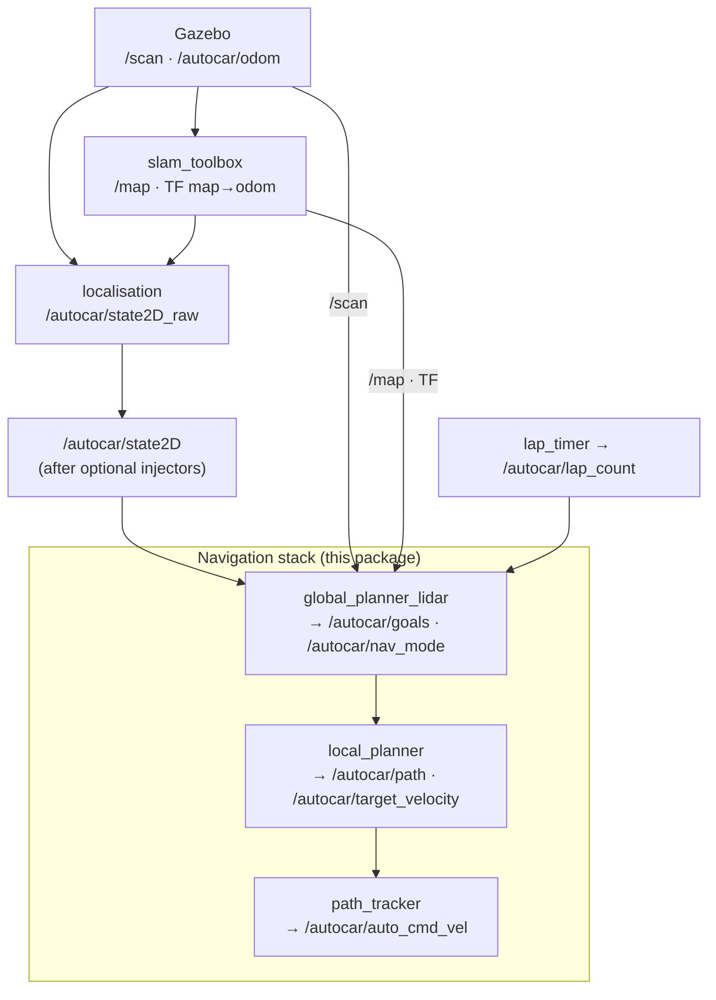
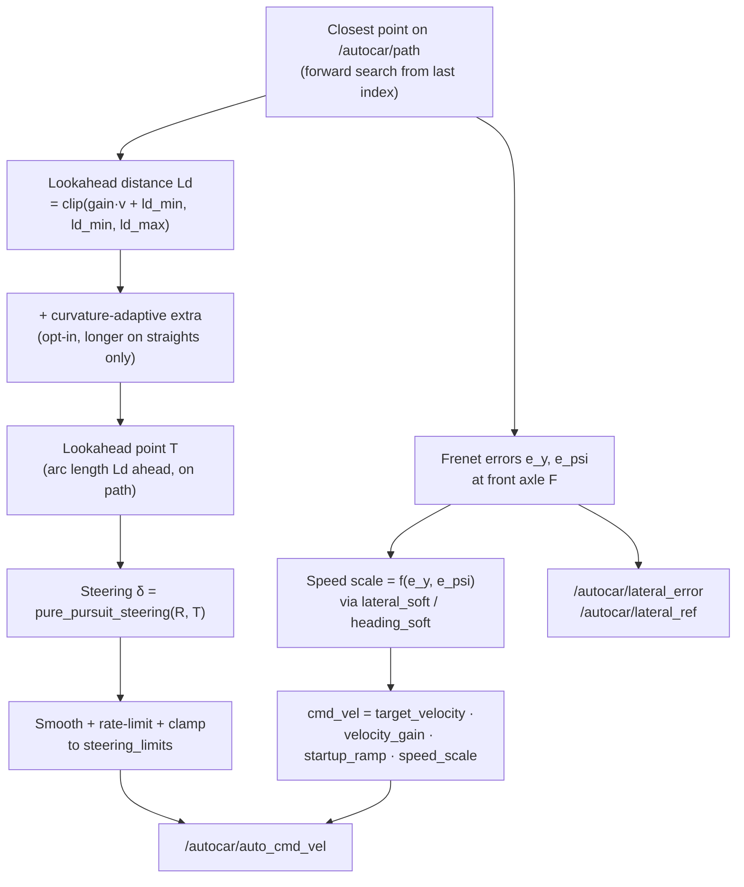

# autocar_nav_pure_pursuit_lidar

LiDAR + SLAM driven Pure Pursuit navigation stack. Two phases in a single simulation session:


| Phase                   | Trigger                                | Path source                                                                                      |
| ----------------------- | -------------------------------------- | ------------------------------------------------------------------------------------------------ |
| **Lap 1 — exploration** | `/autocar/lap_count < 1`               | Live LiDAR + SLAM `/map` → local corridor centerline; driven trajectory recorded in map frame    |
| **Lap 2+ — racing**     | `/autocar/lap_count == 1` (built once) | Lap-1 driven path → closed-loop resample → map corridor → min-curvature → Laplacian smooth       |


No precomputed waypoint CSV; the map stays in memory only (`slam_toolbox` does not save to disk).

---

## Data flow

### Overview

One-way pipeline: **pose + sensors → `/autocar/goals` → `/autocar/path` → Pure Pursuit cmd**. Lap 1 builds the SLAM map while following live LiDAR goals and records the driven trajectory; when `/autocar/lap_count` reaches 1, `global_planner_lidar` builds a cached racing line from that trajectory (with map-derived corridor bounds) and switches `/autocar/nav_mode` to racing.




Each stack node also subscribes to `/autocar/state2D` for pose; only the primary data chain is drawn above.


| Stage   | Node (package)                    | Main inputs                                                     | Main outputs                                |
| ------- | --------------------------------- | --------------------------------------------------------------- | ------------------------------------------- |
| SLAM    | `slam_toolbox`                    | `/scan`, odom TF                                                | `/map`, `map→odom` TF                       |
| Pose    | `localisation` (this pkg)         | `/autocar/odom`, SLAM TF                                        | `/autocar/state2D_raw`                      |
| Goals   | `global_planner_lidar` (this pkg) | `/autocar/state2D`, `/scan`, `/map`, `/autocar/lap_count`       | `/autocar/goals`, `/autocar/nav_mode`       |
| Path    | `local_planner` (this pkg)        | `/autocar/state2D`, `/autocar/goals`, `/autocar/nav_mode`       | `/autocar/path`, `/autocar/target_velocity` |
| Control | `path_tracker` (this pkg)         | `/autocar/state2D`, `/autocar/path`, `/autocar/target_velocity` | `/autocar/auto_cmd_vel`                     |


Optional nodes from `autocar_nav` (latency / odom noise injectors, `lap_timer`, `control_manager`) sit between `/autocar/state2D_raw` and `/autocar/state2D`, or on the `/autocar/cmd_vel` path — see [Launch and external nodes](#launch-and-external-nodes).

### Lap 1 — exploration (`/autocar/nav_mode = 0`)

First lap: follow the corridor with live LiDAR while SLAM builds `/map`. Per-lap pipeline:

| Step | Node | Output |
| ---- | ---- | ------ |
| Sense & pose | `slam_toolbox` + `localisation` | `/map`, TF, `/autocar/state2D_raw` |
| Goals (10 Hz) | `global_planner_lidar` | `/autocar/goals` |
| Path & speed | `local_planner` | `/autocar/path`, `/autocar/target_velocity` (`exploration_velocity`) |
| Control (50 Hz) | `path_tracker` | `/autocar/auto_cmd_vel` |

While `lap_count < 1`, `global_planner_lidar`'s 10 Hz timer (`timer_cb`) does two independent things:

**1. Record the driven path** (`_record_explore_pose`)

- Reads the car's pose in the **map** frame from the live `map→base_link` TF.
- Appends `(x, y)` to `_explore_path` whenever the car has moved ≥ `centerline_step` (default 3.5 m) since the last sample.
- `_explore_path` is the **only** centerline seed used to build the lap-2 racing line — there is no separate corridor-marching step.

**2. Publish short-range goals** (`_publish_exploration_goals` → `extract_local_centerline`)

- Builds `exploration_goal_count` goal points spaced `exploration_goal_step` apart, trying in order:
  1. **Scan-based** (`centerline_from_scan`): for each goal distance, take the centre of the largest open gap in `/scan` within a ±60° forward cone (`FORWARD_CONE`), blended with the gap direction at a mid-range "anticipation" distance so the car starts turning before the outer wall enters the close-range scan.
  2. **Map-based fallback** (`centerline_from_map`): if the scan gives <2 usable points, cast lateral rays on `/map` from points ahead of the car and take the corridor midpoint.
  3. **Straight-ahead fallback**: if both fail, project forward along the car's current heading.
- **Anchor alignment**: instead of the car's body heading, the spline-start tangent is aligned with the vector from the car to the **first goal point**. Two points are prepended — one `exploration_goal_step` behind the car along that direction, one at the car's position — so `local_planner`'s cubic spline immediately follows the corridor instead of the car's raw heading.
- Publishes via `_emit_goals()` → `/autocar/goals`, `/autocar/viz_goals` (mode `explore`, always forced since the goals change every tick).

### Lap 2+ — racing (`/autocar/nav_mode = 1`)

When `lap_timer` reports `/autocar/lap_count == 1`, `lap_cb` resets `_racing_line_ready = False` and logs `Lap 1 complete — building racing line from SLAM map`. From then on, `timer_cb` branches on `_racing_line_ready`:

- **Not ready yet**: `nav_mode` stays `0` — the car keeps driving on exploration goals at `exploration_velocity` — and, if no build thread is running, `timer_cb` spawns `_build_racing_line_from_map` on a daemon thread.
- **Ready**: `nav_mode = 1`, `local_planner` switches to `cruise_velocity`, and every tick calls `_publish_racing_goals()` instead of the exploration path.

**Build** (`_build_racing_line_from_map`, background thread, runs once):

1. **Seed**: snapshot `_explore_path` (map frame). Abort with `Exploration path too short: N points` if it has fewer than `centerline_min_points`.
2. **Close-loop resample**: append the first point to the end, compute cumulative arc length, and resample at uniform `centerline_step` spacing — this collapses the start/finish gap onto the main straight so the loop has no seam jump.
3. **Corridor bounds** (if `racing_use_map_corridor`): for every centerline point, cast lateral rays on the SLAM grid to get per-point left/right clearance (`map_corridor_bounds_for_polyline`) and the mean corridor half-width (`mean_corridor_half_width`).
4. **Min-curvature** (`compute_mincurv_racing_line`): gradient-descend a per-point lateral offset along the inward normal (`racing_mincurv_iters` steps) to minimise curvature, clamped to the step-3 corridor bounds (or ±`racing_mincurv_max_offset` without a map corridor). Falls back to the centerline if curvature doesn't improve — logged as `mincurv ... (fallback: centerline)`.
5. **Laplacian smooth** (`compute_smooth_racing_line`): pre-smooth, optional coarse-resample-and-smooth pass, then iterative smoothing clamped to `racing_smooth_max_dev` away from the min-curv line; validated against the centerline corridor and required to improve the minimum turn radius. Falls back to the min-curv line if it doesn't pass — logged as `smooth ... (fallback: original)`.
6. **Cleanup**: `snap_racing_line_to_free_space` pulls any point too close to an occupied cell back toward the nearest centerline point (25% per iteration); `remove_fold_backs` then drops points where the path reverses direction by >~107° (loop-seam/snap artefacts — legitimate hairpins stay under ~40°), logging `Racing line: removed N fold-back points` if any are dropped.
7. **Finalise**: abort if fewer than `wp_ahead + wp_behind + 2` points remain (`Racing line: only X points after cleanup`). Otherwise compute the heading-disambiguated index nearest the front axle as `init closest_id`, then set `rx_map`, `ry_map`, `racing_n`, `closest_id`, `_racing_goals_force_once = True`, and **`_racing_line_ready = True` last** — so the main thread never observes a half-built racing line. Logs `Racing line ready: ...` with the curvature/offset summary, cached in **map** frame.

**Publish** (`_publish_racing_goals`, 10 Hz once ready):

1. Transform the cached **map**-frame racing line to **odom** using the *live* `map→odom` TF — re-applied every tick, since SLAM loop closure keeps adjusting this transform after lap 1.
2. From the front axle, search for the closest point starting at `closest_id` within `waypoint_search_ahead`. If that's >6 m away, retry with a heading-disambiguated closest search; if still >6 m (only happens right after the build, before `closest_id` has caught up), do a direction-aware global re-acquire — the nearest point that is *ahead* of the car — and log `Racing closest re-acquired (forward): idx K`.
3. Slide a `waypoints_ahead`/`waypoints_behind` window around the new `closest_id`. If the car has nearly reached that point (within `passed_threshold`), shift the window forward by one index (one fewer behind, one more ahead).
4. **Seam-safe windowing**: the "behind" side never wraps backward past index 0 (which would send goals across the finish line behind the car); a forward wrap past the end of the loop is fine (`mode = wrap`).
5. Drop any windowed points still behind the front axle, then prepend two anchor points — using the car's body heading this time, not the chord to the first goal — for a smooth spline start (`_prepend_path_anchors`).
6. Validate the polyline (`_goal_polyline_ok`): reject if any segment is too long or the first point is too far from the axle. On rejection, log `Racing goals rejected: bad spacing near idx K`, return `False`, and `timer_cb` falls back to publishing exploration goals for that tick (with a throttled `Racing goals unavailable — holding exploration goals` warning).
7. Publish via `_emit_goals()` → `/autocar/goals`, `/autocar/viz_goals` (mode ∈ `start` / `race` / `wrap`).

### Coordinate frames


| Frame       | Role                                                                                        |
| ----------- | ------------------------------------------------------------------------------------------- |
| `odom`      | RViz fixed frame; `/autocar/state2D`, `/autocar/goals`, and `/autocar/path` are in odom     |
| `map`       | SLAM map frame; centerline extraction and racing line are computed here                     |
| `base_link` | Vehicle body; `State2D.pose.theta` aligns with body +y, forward direction `(-sin θ, cos θ)` |


**`slam_pose.py`** handles 2D `map↔odom` transforms; consistent with the body-yaw convention in **`pure_pursuit.py`**.

### Pure Pursuit control (`path_tracker`)

`path_tracker` runs the same rear-axle Pure Pursuit loop at `update_frequency` (50 Hz) in both phases — only `/autocar/target_velocity` and the upstream `/autocar/path` source differ between lap 1 (exploration) and lap 2+ (racing).

**Geometry** (`pure_pursuit.py`):

```
                       T   lookahead point on /autocar/path
                      ╱     (arc length Ld ahead of R, along the path)
                Ld  ╱
                  ╱
                ╱ α
   R ●───────●────────────────▶  forward = (-sin θ, cos θ)
     └───L───┘ F
   rear axle    front axle
   (Pure Pursuit  (e_y / e_psi Frenet errors,
    reference)     /autocar/lateral_error)
```

- **R** — rear axle (`rear_axle_pose`), the Pure Pursuit reference point.
- **F** — front axle (`front_axle_pose`), `L` (wheelbase) ahead of `R`; used only for the Frenet lateral/heading errors `e_y`, `e_psi`.
- **T** — lookahead point: from the closest point on `/autocar/path`, walk forward accumulating arc length until it reaches `Ld` (`find_lookahead_point`).
- **α** — angle between the vehicle's forward direction and the chord `R→T` (`pure_pursuit_steering`).

**Steering law:**

```
α     = atan2(lateral(R→T), longitudinal(R→T))     # heading error to T, body frame
chord = |R→T|                                       # ≈ Ld
δ     = -atan2(2 · L · sin(α), chord)               # bicycle-model steering angle
```

This is the standard Pure Pursuit law `δ = atan(2·L·sin(α) / Ld)` — equivalently, the front wheel is steered to put the rear axle on a circular arc of radius `Ld / (2 sin α)` through `T` — negated here for the simulator's steering sign convention.

**Per-cycle flow** (`pure_pursuit_control`, 50 Hz):



**Tuning** (`config/navigation_params.yaml` → `path_tracker`):

| Parameter | Default | Effect |
| --- | --- | --- |
| `lookahead_gain` / `_min` / `_max` | 0.4 / 1.5 / 6.0 | `Ld = clip(gain·v + min, min, max)` — longer lookahead at higher speed |
| `lookahead_curv_extra/soft/window` | 0 (off) | Adds lookahead only on straights (anti-zigzag) without lengthening it in corners |
| `wheelbase`, `centreofgravity_to_*axle` | 2.966 m, 1.483 m | Bicycle-model `L` and axle offsets from `State2D.pose` |
| `steering_limits`, `steering_rate_limit`, `steer_smoothing` | 0.95 rad, 4.0 rad/s, 1.0 | Final steering clamp, max rate of change, low-pass filter |
| `lateral_soft`, `heading_soft` | 4.0 m, 0.6 rad | Speed-scale decay vs. `e_y`/`e_psi` (1.0 on-path → 0 far off) |
| `velocity_gain`, `startup_ramp_s` | 1.0, 2.0 s | Global speed scale and linear ramp-in after startup |

---

## Package layout

```
autocar_nav_pure_pursuit_lidar/
├── CMakeLists.txt              # ament_cmake build; installs Python pkg, 4 node scripts, config/
├── package.xml                 # autocar_msgs, slam_toolbox, tf2_ros, rclpy, … (no autocar_nav_pure_pursuit)
├── README.md
├── config/
│   ├── navigation_params.yaml  # per-node ROS parameters (see below)
│   └── slam_toolbox.yaml       # async SLAM: resolution, scan topic, loop closing, etc.
├── data/
│   └── .gitkeep                # reserved; no static map files currently
├── nodes/                      # ROS 2 executables (installed to lib/...)
│   ├── localisation.py
│   ├── global_planner_lidar.py
│   ├── localplanner.py
│   └── tracker.py
└── autocar_nav_pure_pursuit_lidar/   # importable Python library
    ├── __init__.py
    ├── centerline_extractor.py
    ├── cubic_spline_interpolator.py
    ├── map_centerline.py
    ├── map_track_geometry.py
    ├── map_localizer.py
    ├── normalise_angle.py
    ├── pure_pursuit.py
    ├── racing_line_mincurv.py
    ├── racing_line_smooth.py
    ├── slam_pose.py
    └── yaw_to_quaternion.py
```

### ROS nodes (`nodes/`)


| File                      | Node name              | Subscribes                                                      | Publishes                                                                 | Role                                                                                          |
| ------------------------- | ---------------------- | --------------------------------------------------------------- | ------------------------------------------------------------------------- | --------------------------------------------------------------------------------------------- |
| `localisation.py`         | `localisation`         | `/autocar/odom`                                                 | `/autocar/state2D_raw`                                                    | Wheel odometry + optional SLAM TF pose                                                        |
| `global_planner_lidar.py` | `global_planner_lidar` | `/autocar/state2D`, `/scan`, `/map`, `/autocar/lap_count`       | `/autocar/goals`, `/autocar/viz_goals`, `/autocar/nav_mode`               | Lap-1 scan/map goals + driven-path recording; background racing-line build; seam-safe sliding-window race goals |
| `localplanner.py`         | `local_planner`        | `/autocar/goals`, `/autocar/state2D`, `/autocar/nav_mode`       | `/autocar/path`, `/autocar/viz_path`, `/autocar/target_velocity`          | Cubic spline path + curvature speed cap                                                       |
| `tracker.py`              | `path_tracker`         | `/autocar/state2D`, `/autocar/path`, `/autocar/target_velocity` | `/autocar/auto_cmd_vel`, `/autocar/lateral_error`, `/autocar/lateral_ref` | Pure Pursuit (measured-speed Ld, optional curvature-adaptive Ld, Frenet speed scaling)        |


### Python library (`autocar_nav_pure_pursuit_lidar/`)


| File                           | Used by                                                 | Purpose                                                                                                                         |
| ------------------------------ | ------------------------------------------------------- | ------------------------------------------------------------------------------------------------------------------------------- |
| `centerline_extractor.py`      | `global_planner_lidar`                                  | Lap 1: `extract_local_centerline` → gap-following scan centerline or map ray casts                                              |
| `map_centerline.py`            | (unused)                                                | Legacy corridor-march centerline from occupancy grid; superseded by driven-path seed                                          |
| `map_track_geometry.py`        | `global_planner_lidar`                                  | Corridor refine, per-point boundary limits, `snap_racing_line_to_free_space`, `remove_fold_backs`                               |
| `racing_line_mincurv.py`       | `global_planner_lidar`                                  | Min-curvature racing line: `centerline + alpha * normal` within corridor                                                        |
| `racing_line_smooth.py`        | `global_planner_lidar`                                  | Laplacian polish after min-curv; validates curvature and track bounds                                                           |
| `pure_pursuit.py`              | `local_planner`, `path_tracker`, `global_planner_lidar`, etc. | Axles, closest point (incl. `closest_waypoint_index_closed_disambiguated`), lookahead (dynamic + curvature-adaptive), steering, curvature speed, Frenet errors |
| `cubic_spline_interpolator.py` | `local_planner`                                         | `generate_cubic_path(ax, ay, ds)` → dense `(x, y, yaw, κ)`                                                                      |
| `slam_pose.py`                 | `localisation`, `global_planner_lidar`                  | `slam_pose_in_odom`, `slam_pose_in_map`, `map_point_to_odom`                                                                    |
| `normalise_angle.py`           | `slam_pose`, `pure_pursuit`, `localisation`             | Wrap angle to -π, π                                                                                                             |
| `yaw_to_quaternion.py`         | `local_planner`, `path_tracker`                         | Quaternion for `/autocar/viz_path` / `/autocar/lateral_ref`                                                                     |
| `map_localizer.py`             | (unused)                                                | Brute-force scan-to-map pose correction; reserved                                                                               |
| `__init__.py`                  | external imports                                        | Exports `extract_local_centerline`, `generate_cubic_path`, `scan_match_pose`, `yaw_to_quaternion`                               |


### Config files (`config/`)

**`navigation_params.yaml`** — per-node namespaces:


| Namespace              | Key parameters                                                                                                                                                                                                 |
| ---------------------- | -------------------------------------------------------------------------------------------------------------------------------------------------------------------------------------------------------------- |
| `localisation`         | `use_slam`, `update_frequency`                                                                                                                                                                                 |
| `local_planner`        | `cruise_velocity`, `exploration_velocity`, `max_lateral_accel`, `curvature_lookahead`, `curvature_smooth_window`, `accel_rate` / `decel_rate`                                                                |
| `global_planner_lidar` | `exploration_goal_*`, `centerline_step` (explore-path spacing + resample), `centerline_min_points`, `racing_*`, `waypoints_ahead/behind`, `waypoint_search_ahead`, `passed_threshold`, `cg_to_lidar`           |
| `path_tracker`         | `lookahead_gain/min/max`, `lookahead_curv_extra/soft/window` (opt-in straight-line anti-zigzag), `wheelbase`, `steering_limits`, `steering_rate_limit`, `lateral_soft`, `heading_soft`, `startup_ramp_s`         |


**`slam_toolbox.yaml`** — `scan_topic: /scan`, `map_frame: map`, `resolution: 0.2`, `map_update_interval: 1.0`, loop closing, etc.

---

## Launch and external nodes

Entry point: `launches/launch/race_pure_pursuit_lidar_launch.py`

### External nodes

Besides this package's 4 nodes + `slam_toolbox`, the launch also starts (see `race_launch_common.navigation_nodes_lidar`):


| Package                          | Node                                      | Role                                                          |
| -------------------------------- | ----------------------------------------- | ------------------------------------------------------------- |
| `autocar_nav`                    | `latency_injector`, `odom_noise_injector` | Optional perception latency / odom noise                      |
| `autocar_nav`                    | `lap_timer`                               | Publishes `/autocar/lap_count`; triggers mode switch          |
| `autocar_nav`                    | `control_manager`                         | Optional when `use_control_manager:=true`                     |
| Gazebo + `robot_state_publisher` | —                                         | Simulation and TF tree                                        |
| RViz                             | —                                         | Default `view_slam.rviz` (`/map` QoS matched to slam_toolbox) |

### Build & run

```bash
sudo apt install ros-humble-slam-toolbox   # or foxy, match your distro

colcon build --packages-select autocar_nav_pure_pursuit_lidar autocar_description launches
source install/setup.bash

ros2 launch launches race_pure_pursuit_lidar_launch.py track:=f1_circuit_fenced
```

Override navigation params (used by `benchmark.py`):

```bash
ros2 launch launches race_pure_pursuit_lidar_launch.py \
  track:=f1_circuit_fenced \
  nav_config:=/path/to/navigation_params.yaml
```

### Benchmark

```bash
python3 scripts/benchmark.py --config scripts/configs/f1_pure_pursuit_lidar.yaml
```

Config: `scripts/configs/f1_pure_pursuit_lidar.yaml`. Requires `lap_count >= 2` (lap 1 = exploration + SLAM map, lap 2+ = racing line). `benchmark.py` materialises inline `navigation:` blocks to `results/benchmark_<ts>/nav_overrides/run_*.yaml` and passes `nav_config:=` to the launch file.

| Profile | Notes |
| ------- | ----- |
| `baseline` | Default `navigation_params.yaml` (cruise 6 m/s) |
| `finetuned` | Stable lap 2+ (cruise 7.5 m/s, curvature-adaptive lookahead, tighter racing smooth) |
| `finetuned_perturbed_*` | 3×3 grid: `latency_ms` ∈ {0, 200, 500} × `odom_noise_std` ∈ {0, 0.05, 0.1} |

---

## Topics

Grouped by pipeline stage (matches the [Data flow](#data-flow) order: sense → lap/mode → plan → control → viz).

### Sensing & pose

| Topic                  | Type            | Publisher      | Subscribers                                             |
| ----------------------- | --------------- | --------------- | --------------------------------------------------------- |
| `/scan`                | `LaserScan`     | Gazebo LiDAR   | `slam_toolbox`, `global_planner_lidar`                  |
| `/map`                 | `OccupancyGrid` | `slam_toolbox` | `global_planner_lidar`, RViz                            |
| `/autocar/odom`        | `Odometry`      | Gazebo         | `localisation`, `slam_toolbox`                          |
| `/autocar/state2D_raw` | `State2D`       | `localisation` | injectors → `/autocar/state2D`                          |
| `/autocar/state2D`     | `State2D`       | injectors      | `global_planner_lidar`, `local_planner`, `path_tracker` |

### Lap & mode

| Topic                | Type    | Publisher              | Subscribers            |
| --------------------- | ------- | ----------------------- | ------------------------ |
| `/autocar/lap_count` | `Int32` | `lap_timer`            | `global_planner_lidar` |
| `/autocar/nav_mode`  | `Int32` | `global_planner_lidar` | `local_planner`        |

### Planning

| Topic                      | Type      | Publisher              | Subscribers     |
| ---------------------------- | --------- | ----------------------- | ----------------- |
| `/autocar/goals`            | `Path2D`  | `global_planner_lidar` | `local_planner` |
| `/autocar/path`             | `Path2D`  | `local_planner`        | `path_tracker`  |
| `/autocar/target_velocity`  | `Float64` | `local_planner`        | `path_tracker`  |

### Control

| Topic                    | Type          | Publisher      | Subscribers           |
| -------------------------- | ------------- | --------------- | ----------------------- |
| `/autocar/auto_cmd_vel`   | `Twist`       | `path_tracker` | → `/autocar/cmd_vel`  |
| `/autocar/lateral_error`  | `Float64`     | `path_tracker` | —                      |
| `/autocar/lateral_ref`    | `PoseStamped` | `path_tracker` | RViz                   |

### Visualization

| Topic                | Type            | Publisher              | Subscribers |
| ----------------------- | ---------------- | ----------------------- | ------------- |
| `/autocar/viz_goals`  | `PoseArray`     | `global_planner_lidar` | RViz        |
| `/autocar/viz_path`   | `nav_msgs/Path` | `local_planner`        | RViz        |


---

## Debugging

### RViz: "No map received"

`slam_toolbox` publishes `/map` with **transient_local + reliable** QoS. The LiDAR launch uses `autocar_description/rviz/view_slam.rviz`. If opening RViz manually: Map → Topic → Durability = **Transient Local**, Reliability = **Reliable**.

### Log messages

**Startup**

| Log                              | Meaning                                                     |
| ----------------------------------- | -------------------------------------------------------------- |
| `SLAM /map received: WxH cells` | `global_planner_lidar` subscribed to the map successfully  |
| `Waiting for SLAM TF`            | `localisation` waiting for `map→odom` / `map→base_link`     |

**Racing-line build (lap 1 → 2, background thread)**

| Log                                                              | Meaning                                                                                                       |
| ------------------------------------------------------------------- | ------------------------------------------------------------------------------------------------------------ |
| `Lap 1 complete — building racing line from SLAM map`           | Lap 1 done; background build thread will start on next timer tick                                            |
| `Exploration path too short: N points`                          | `_explore_path` has fewer than `centerline_min_points`; racing line build deferred                           |
| `mincurv ... (fallback: centerline)`                            | Min-curv did not beat centerline curvature; using centerline for smooth step                                 |
| `smooth ... (fallback: original)`                               | Laplacian polish skipped; using min-curv line as-is                                                          |
| `Min-curvature racing line failed` / `Racing line smooth failed` | Optimisation step raised; build aborted                                                                       |
| `Racing line: removed N fold-back points`                       | Post-smooth cleanup stripped direction-reversal artefacts                                                    |
| `Racing line: only X points after cleanup`                      | Too few points remain; racing mode not activated yet                                                         |
| `Racing line ready: N pts … init closest_id=K`                  | Build done; `K` is the heading-disambiguated index nearest the front axle — first goal window centres there |
| `Racing line build failed:`                                     | Background thread exception (traceback logged); car stays in exploration goals                              |

**Runtime — goal publishing**

| Log                                                     | Meaning                                                                                          |
| ----------------------------------------------------------- | ----------------------------------------------------------------------------------------------- |
| `Goals (#K mode): N pts`                               | Published `/autocar/goals` window (throttled); `mode` is `explore`, `race`, `wrap`, or `start`  |
| `Racing closest re-acquired (forward): idx K`          | Windowed search was >6 m off; re-acquired nearest point ahead of the car                         |
| `Racing goals rejected: bad spacing near idx K`        | `/autocar/goals` polyline had a segment jump; exploration `/autocar/goals` kept for this cycle  |
| `Racing goals unavailable — holding exploration goals` | TF or validation failed; temporary fallback to lap-1-style `/autocar/goals`                     |


### Quick checks

```bash
ros2 topic hz /map
ros2 topic hz /scan
ros2 run tf2_ros tf2_echo map odom
ros2 topic echo /autocar/nav_mode --once
```

---

## Package dependencies

```
autocar_nav_pure_pursuit_lidar
├── autocar_msgs
├── slam_toolbox
├── tf2_ros
├── rclpy / geometry_msgs / nav_msgs / sensor_msgs
└── python3-numpy

Runtime (started by launch, not in package.xml):
├── autocar_nav         (lap_timer, injectors, control_manager)
├── autocar_description (URDF, view_slam.rviz)
├── launches
└── Gazebo world
```

This package does **not** depend on `autocar_nav_pure_pursuit` or `autocar_racing_line`; path algorithms are implemented locally.