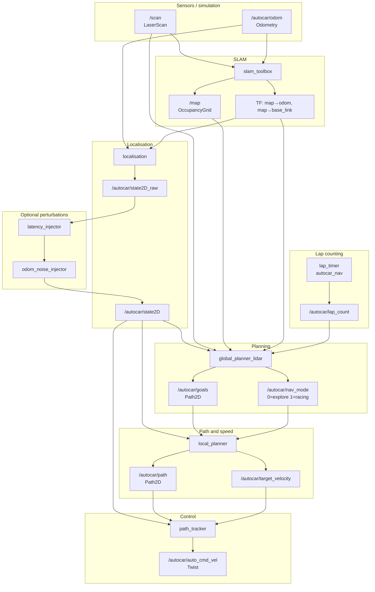

# autocar_nav_pure_pursuit_lidar

LiDAR + SLAM driven Pure Pursuit navigation stack. Two phases in a single simulation session:

| Phase | Trigger | Path source |
|-------|---------|-------------|
| **Lap 1 — exploration** | `lap_count < 1` | Live LiDAR + SLAM `/map` → local corridor centerline |
| **Lap 2+ — racing** | `lap_count == 1` (built once) | Lap-1 SLAM map → centerline → min-curvature → Laplacian smooth |

No precomputed waypoint CSV; the map stays in memory only (`slam_toolbox` does not save to disk).

---

## Data flow

### Overview



### Lap 1 — exploration (`nav_mode = 0`)

1. **Gazebo** publishes `/scan` and `/autocar/odom`.
2. **`slam_toolbox`** subscribes to `/scan` + odom TF, builds the map asynchronously, publishes `/map` (~1 Hz) and `map→odom` TF.
3. **`localisation`** composes `map→odom` and `map→base_link`, outputs SLAM-corrected `/autocar/state2D_raw`.
4. **`global_planner_lidar`** (10 Hz):
   - Uses **`centerline_extractor.centerline_from_scan`** on `/scan`: for each goal distance `d`, finds the **largest contiguous arc of scan rays unobstructed at `d`** and places the goal at the arc's center angle. This gap-following approach steers naturally through corners and hairpins where a wall directly ahead would be invisible to a simple lateral-offset method.
   - Falls back to **`centerline_from_map`** (lateral ray casts on the occupancy grid) when no scan is available.
   - Prepends two anchor points behind the car; scan-based points are already in odom frame and are published directly (no extra frame transform).
   - Publishes `/autocar/goals` (`Path2D` polyline).
5. **`local_planner`** cubic-splines the goals (**`cubic_spline_interpolator`**), limits speed by curvature (`exploration_velocity`), publishes `/autocar/path` and `/autocar/target_velocity`.
6. **`path_tracker`** runs **`pure_pursuit`** steering and throttle, publishes `/autocar/auto_cmd_vel` (remapped to `/autocar/cmd_vel` by default).

### Lap 2+ — racing (`nav_mode = 1`)

Triggered exactly once when `/autocar/lap_count == 1` (from **`lap_timer`**). The racing line is built once from the lap-1 SLAM map and reused for all subsequent laps.

1. **`global_planner_lidar`** builds the racing line from the completed SLAM map:
   - **`map_centerline.extract_loop_centerline_from_map`**: march the loop, then **`map_track_geometry.refine_closed_centerline_from_map`** re-snaps each vertex to the geometric midpoint between map ray-cast boundaries;
   - **`map_track_geometry.map_corridor_bounds_for_polyline`**: per-point left/right clearance from the grid (`racing_use_map_corridor`);
   - **`racing_line_mincurv.compute_mincurv_racing_line`**: min-curvature optimise inside the map-derived asymmetric corridor (not a fixed ±5 m);
   - **`racing_line_smooth.compute_smooth_racing_line`**: Laplacian polish, bounded by measured corridor half-width;
   - Caches `rx_map/ry_map` in the **map** frame; transforms to odom via a snapshot `map→odom` TF taken at build time (avoids goal jitter).
2. Sliding-window waypoints along the racing line (`waypoints_ahead/behind`) using **wrapped index arithmetic** (`i % racing_n`) so the loop seam between the last and first waypoint is seamless. Publishes `/autocar/goals`.
3. Downstream **`local_planner`** / **`path_tracker`** unchanged except cruise speed uses `cruise_velocity`.

### Coordinate frames

| Frame | Role |
|-------|------|
| `odom` | RViz fixed frame; `state2D`, goals, and path are in odom |
| `map` | SLAM map frame; centerline extraction and racing line are computed here |
| `base_link` | Vehicle body; `State2D.pose.theta` aligns with body +y, forward direction `(-sin θ, cos θ)` |

**`slam_pose.py`** handles 2D `map↔odom` transforms; consistent with the body-yaw convention in **`pure_pursuit.py`**.

---

## Package layout

```
autocar_nav_pure_pursuit_lidar/
├── CMakeLists.txt              # ament_cmake build; installs Python pkg, config, nodes
├── package.xml                 # ROS deps (no autocar_nav_pure_pursuit)
├── README.md
├── config/
│   ├── navigation_params.yaml  # per-node ROS parameters (see below)
│   └── slam_toolbox.yaml       # async SLAM: resolution, scan topic, loop closing, etc.
├── data/
│   └── .gitkeep                # reserved; no static map files currently
├── nodes/                      # ROS 2 executables (installed to lib/...)
│   ├── localisation.py
│   ├── global_planner_lidar.py
│   ├── localplanner.py
│   └── tracker.py
└── autocar_nav_pure_pursuit_lidar/   # importable Python library
    ├── __init__.py
    ├── centerline_extractor.py
    ├── cubic_spline_interpolator.py
    ├── map_centerline.py
    ├── map_track_geometry.py
    ├── map_localizer.py
    ├── normalise_angle.py
    ├── pure_pursuit.py
    ├── racing_line_mincurv.py
    ├── racing_line_smooth.py
    ├── slam_pose.py
    └── yaw_to_quaternion.py
```

### ROS nodes (`nodes/`)

| File | Node name | Subscribes | Publishes | Role |
|------|-----------|------------|-----------|------|
| `localisation.py` | `localisation` | `/autocar/odom` | `/autocar/state2D_raw` | Wheel odometry + optional SLAM TF pose |
| `global_planner_lidar.py` | `global_planner_lidar` | `state2D`, `/scan`, `/map`, `lap_count` | `/autocar/goals`, `/autocar/viz_goals`, `/autocar/nav_mode` | Explore/race mode switch; publishes goals |
| `localplanner.py` | `local_planner` | `/autocar/goals`, `state2D`, `nav_mode` | `/autocar/path`, `/autocar/viz_path`, `target_velocity` | Cubic spline path + curvature speed cap |
| `tracker.py` | `path_tracker` | `state2D`, `/autocar/path`, `target_velocity` | `/autocar/auto_cmd_vel`, `lateral_error`, `lateral_ref` | Pure Pursuit lateral + longitudinal control |

### Python library (`autocar_nav_pure_pursuit_lidar/`)

| File | Used by | Purpose |
|------|---------|---------|
| `centerline_extractor.py` | `global_planner_lidar` | Lap 1: gap-following centerline from `/scan` (largest clear arc per distance) or lateral ray casts on `/map` |
| `map_centerline.py` | `global_planner_lidar` | Lap 2+: closed-loop centerline from occupancy grid |
| `map_track_geometry.py` | `global_planner_lidar` | Map-native corridor refine + per-point boundary limits |
| `racing_line_mincurv.py` | `global_planner_lidar` | Min-curvature racing line: `centerline + alpha * normal` within corridor |
| `racing_line_smooth.py` | `global_planner_lidar` | Laplacian polish after min-curv; validates curvature and track bounds |
| `pure_pursuit.py` | `localplanner`, `tracker`, `global_planner_lidar`, etc. | Geometry: axles, closest point, lookahead, steering, curvature speed, Frenet errors |
| `cubic_spline_interpolator.py` | `localplanner` | `generate_cubic_path(ax, ay, ds)` → dense `(x, y, yaw, κ)` |
| `slam_pose.py` | `localisation`, `global_planner_lidar` | `slam_pose_in_odom`, `slam_pose_in_map`, `map_point_to_odom` |
| `normalise_angle.py` | `slam_pose`, `pure_pursuit`, `localisation` | Wrap angle to \[-π, π\] |
| `yaw_to_quaternion.py` | `localplanner`, `tracker` | Quaternion for path viz / lateral_ref |
| `map_localizer.py` | (unused) | Brute-force scan-to-map pose correction; reserved |
| `__init__.py` | external imports | Exports `extract_local_centerline`, `generate_cubic_path`, `scan_match_pose`, `yaw_to_quaternion` |

### Config files (`config/`)

**`navigation_params.yaml`** — per-node namespaces:

| Namespace | Key parameters |
|-----------|----------------|
| `localisation` | `use_slam`, `update_frequency` |
| `local_planner` | `cruise_velocity`, `exploration_velocity`, `max_lateral_accel`, curvature lookahead |
| `global_planner_lidar` | `exploration_goal_*`, `centerline_*`, `racing_mincurv_*`, `racing_smooth_*`, `waypoints_ahead/behind` |
| `path_tracker` | `lookahead_gain/min/max`, `wheelbase`, `steering_limits`, `lateral_soft` |

**`slam_toolbox.yaml`** — `scan_topic: /scan`, `map_frame: map`, `resolution: 0.2`, `map_update_interval: 1.0`, loop closing, etc.

### Build files

| File | Description |
|------|-------------|
| `CMakeLists.txt` | `ament_python_install_package` + installs 4 node scripts and `config/` |
| `package.xml` | Depends on `autocar_msgs`, `slam_toolbox`, `tf2_ros`, `rclpy`, … |

---

## Launch and external nodes

Entry point: `launches/launch/race_pure_pursuit_lidar_launch.py`

Besides this package's 4 nodes + `slam_toolbox`, the launch also starts (see `race_launch_common.navigation_nodes_lidar`):

| Package | Node | Role |
|---------|------|------|
| `autocar_nav` | `latency_injector`, `odom_noise_injector` | Optional perception latency / odom noise |
| `autocar_nav` | `lap_timer` | Publishes `/autocar/lap_count`; triggers mode switch |
| `autocar_nav` | `control_manager` | Optional when `use_control_manager:=true` |
| Gazebo + `robot_state_publisher` | — | Simulation and TF tree |
| RViz | — | Default `view_slam.rviz` (`/map` QoS matched to slam_toolbox) |

```bash
sudo apt install ros-humble-slam-toolbox   # or foxy, match your distro

colcon build --packages-select autocar_nav_pure_pursuit_lidar autocar_description launches
source install/setup.bash

ros2 launch launches race_pure_pursuit_lidar_launch.py track:=f1_circuit_fenced
```

Benchmark:

```bash
python3 scripts/benchmark.py --config scripts/configs/f1_pure_pursuit_lidar.yaml
```

---

## Topics

| Topic | Type | Publisher | Subscribers |
|-------|------|-----------|-------------|
| `/scan` | `LaserScan` | Gazebo LiDAR | `slam_toolbox`, `global_planner_lidar` |
| `/map` | `OccupancyGrid` | `slam_toolbox` | `global_planner_lidar`, RViz |
| `/autocar/odom` | `Odometry` | Gazebo | `localisation`, `slam_toolbox` |
| `/autocar/state2D_raw` | `State2D` | `localisation` | injectors → `state2D` |
| `/autocar/state2D` | `State2D` | injectors | planning + control nodes |
| `/autocar/lap_count` | `Int32` | `lap_timer` | `global_planner_lidar` |
| `/autocar/nav_mode` | `Int32` | `global_planner_lidar` | `local_planner` |
| `/autocar/goals` | `Path2D` | `global_planner_lidar` | `local_planner` |
| `/autocar/path` | `Path2D` | `local_planner` | `path_tracker` |
| `/autocar/target_velocity` | `Float64` | `local_planner` | `path_tracker` |
| `/autocar/auto_cmd_vel` | `Twist` | `path_tracker` | → `/autocar/cmd_vel` |

---

## Debugging

### RViz: "No map received"

`slam_toolbox` publishes `/map` with **transient_local + reliable** QoS. The LiDAR launch uses `autocar_description/rviz/view_slam.rviz`. If opening RViz manually: Map → Topic → Durability = **Transient Local**, Reliability = **Reliable**.

### Log messages

| Log | Meaning |
|-----|---------|
| `SLAM /map received: WxH cells` | `global_planner_lidar` subscribed to the map successfully |
| `Switching to RACING mode` | Lap 1 complete; building racing line from SLAM map (once) |
| `Racing line ready: N pts` | Min-curv + smooth pipeline done (check `mincurv R_min` and `smooth R_min`) |
| `mincurv ... (fallback: centerline)` | Min-curv did not beat centerline curvature; using centerline for smooth step |
| `smooth ... (fallback: original)` | Laplacian polish skipped; using min-curv line as-is |
| `Centerline extraction: only X points` | Map incomplete; racing goals not published yet |
| `Waiting for SLAM TF` | `localisation` waiting for `map→odom` / `map→base_link` |

### Quick checks

```bash
ros2 topic hz /map
ros2 topic hz /scan
ros2 run tf2_ros tf2_echo map odom
ros2 topic echo /autocar/nav_mode --once
```

---

## Package dependencies

```
autocar_nav_pure_pursuit_lidar
├── autocar_msgs
├── slam_toolbox
├── tf2_ros
├── rclpy / geometry_msgs / nav_msgs / sensor_msgs
└── python3-numpy

Runtime (started by launch, not in package.xml):
├── autocar_nav         (lap_timer, injectors, control_manager)
├── autocar_description (URDF, view_slam.rviz)
├── launches
└── Gazebo world
```

This package does **not** depend on `autocar_nav_pure_pursuit` or `autocar_racing_line`; path algorithms are implemented locally.
